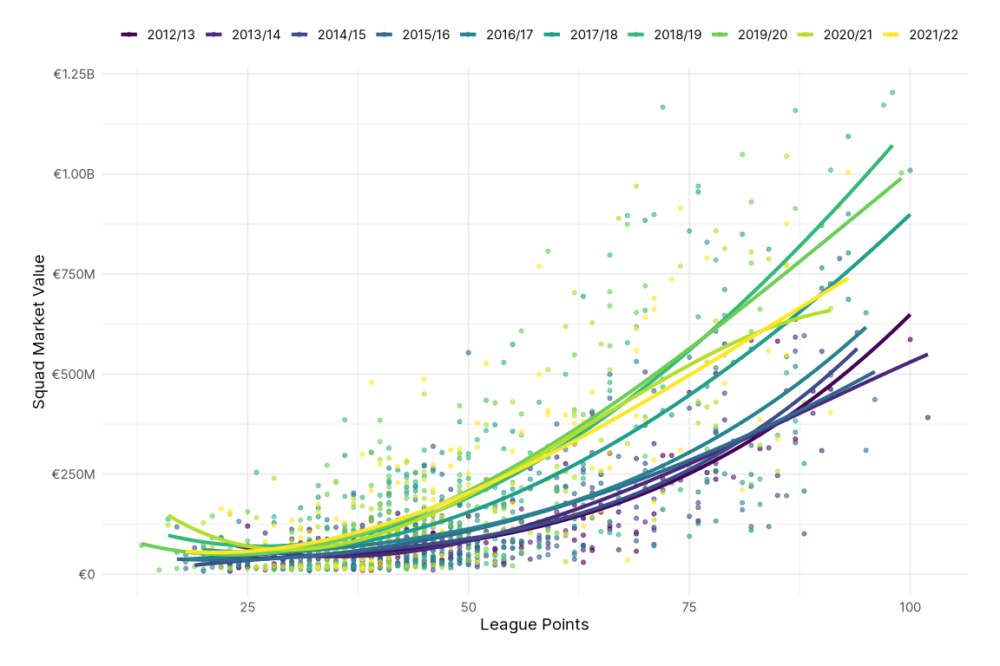
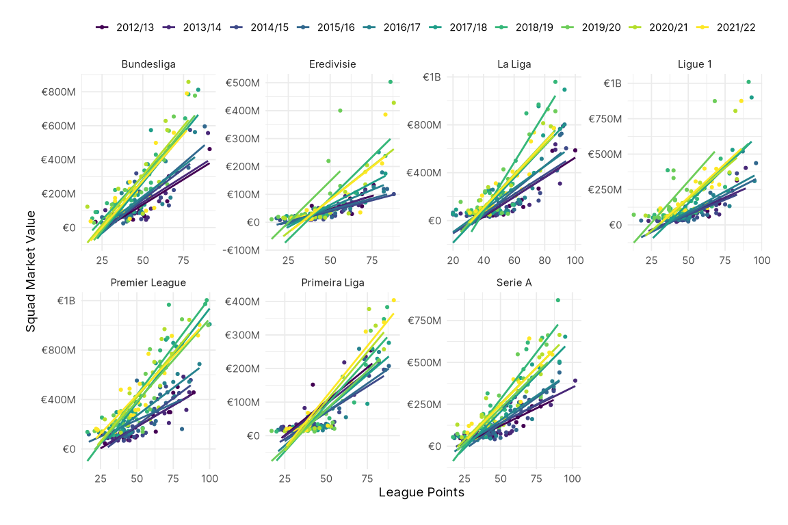

Exploratory Data Analysis - Visualizing the Untold Riches in Football
================
Paul Johnson

- <a href="#points-totals" id="toc-points-totals">Points Totals</a>
  - <a href="#points-distributions-across-leagues"
    id="toc-points-distributions-across-leagues">Points Distributions Across
    Leagues</a>
    - <a href="#the-austria-problem" id="toc-the-austria-problem">The Austria
      Problem</a>
- <a href="#net-transfer-spending" id="toc-net-transfer-spending">Net
  Transfer Spending</a>
- <a href="#squad-depth" id="toc-squad-depth">Squad Depth</a>
  - <a href="#the-relationship-between-squad-depth-points"
    id="toc-the-relationship-between-squad-depth-points">The Relationship
    Between Squad Depth &amp; Points</a>
- <a href="#injuries" id="toc-injuries">Injuries</a>
- <a href="#squad-market-values" id="toc-squad-market-values">Squad Market
  Values</a>
  - <a href="#distributions-of-squad-values-across-leagues"
    id="toc-distributions-of-squad-values-across-leagues">Distributions of
    Squad Values Across Leagues</a>
  - <a href="#the-relationship-between-squad-value-points"
    id="toc-the-relationship-between-squad-value-points">The Relationship
    Between Squad Value &amp; Points</a>
    - <a href="#the-variance-in-relationship-over-time"
      id="toc-the-variance-in-relationship-over-time">The Variance in
      Relationship Over Time</a>

# Points Totals

The first step in understanding how club resources effects league
performance is exploring the data.

``` r
club_resources %>%
  ggplot(aes(pts)) +
  geom_histogram() +
  labs(x = "League Points", y = NULL)
```


The distribution of points appears to be relatively normal with a longer
right tail, suggesting there might be some issues with extreme values.
This will be, in part, due to the different number of teams in each
league, though I think the number of games each league season plays
should be captured by a multilevel model.

## Points Distributions Across Leagues

Visualizing the distribution of all points totals across leagues and
seasons aggregates to a level that risks missing some important detail.

``` r
club_resources %>%
  ggplot(aes(pts, fill = league)) +
  geom_histogram() +
  scale_fill_viridis_d(guide = guide_legend(nrow = 1)) +
  labs(x = "League Points", y = NULL)
```


``` r
club_resources %>%
  ggplot(aes(pts, fill = league)) +
  geom_histogram(binwidth = 5) +
  scale_fill_viridis_d(guide = guide_legend(nrow = 1)) +
  facet_wrap(~ league) +
  labs(x = "League Points", y = NULL)
```


However, facetting the points distributions by league demonstrates that
all of the leagues are a little bit right-skewed (long right tails).

How do league points vary by season? Has there been a change in the way
points are distributed over time?

``` r
club_resources %>%
  ggplot(aes(x = pts, y = season, fill = league)) +
  ggridges::geom_density_ridges(alpha = 0.8) +
  scale_fill_viridis_d(guide = guide_legend(nrow = 1)) +
  facet_wrap(~ league) +
  labs(x = "League Points", y = NULL)
```


For seven of the eight leagues there doesn’t appear to be any
interesting changes in league points over time. However, there has been
a notable decline in total league points in the Austrian Bundesliga over
the last few seasons.

### The Austria Problem

``` r
club_resources %>%
  filter(league == "Austrian Bundesliga") %>%
  group_by(season) %>%
  summarise(pts = median(pts))
```

    # A tibble: 10 × 2
       season    pts
       <fct>   <dbl>
     1 2012/13  46.5
     2 2013/14  45.5
     3 2014/15  48  
     4 2015/16  45.5
     5 2016/17  46  
     6 2017/18  48.5
     7 2018/19  41  
     8 2019/20  40  
     9 2020/21  29.5
    10 2021/22  29.5

The average points drop after 2017/18, from around 45-48 points to
around 40 for a couple seasons, and then below 30 for the last two
seasons. This is because the Austrian Bundesliga expanded from 10 to 12
teams in the 20118/19 season, however, the way the league was structured
also changed. The Austrian Bundesliga now plays 22 games in a regular
season, before splitting in two, with the top six teams playing in a
“Championship playoff” and the bottom six teams playing in a “Relegation
playoff”. Each team then plays 10 games in the playoff.

The change in the league structure presents a number of problems,
however, the biggest issue of all is that there is an inconsistency in
the way FB Ref has reported league tables since the restructure. In the
first two seasons after the restructure, FB Ref reports a total league
table that includes all games played in the regular season and the
playoff rounds, totaling 32 games, and then reports a regular season
table and each of the playoff tables underneath. In the last two seasons
FB Ref has reported only the regular season table and then the two
playoff tables underneath. This means that the R package
{worldfootballR} is scraping inconsistent league table data, because it
is obviously unaware of the discrepancies in how the tables are being
reported.

Because of these inconsistencies, there is no easy fix. If the
post-restructuring league tables included all games played then I could
probably live with a small drop in total games played (from 36 to 32)
and the slight bias in points totals for mid-table teams (if a team
finishes sixth they then face tougher opponents for their final 10 games
than the team in seventh, leading to them finishing on lower points
totals despite possibly being a better team), or if it was just the
regular season tables, I could use the points per game as a standardized
measure of points per league season. That it is a little from Column A
and a little from Column B gives me few options!

As a result, I will drop the Austrian Bundesliga from the analysis, and
move forward with the seven remaining leagues. An odd number… Like some
sort of savage.

``` r
club_resources <- 
  club_resources %>%
  filter(league != "Austrian Bundesliga")
```

# Net Transfer Spending

I know that points should be on the y-axis, because it is the dependent
variable, here but the plots are harder to read when I do that, so I’m
committing data visualization sins in service to **aesthetics**. But
either way, I’m clearly plotting a line through a mess here.

Perhaps the only interesting bit we can take from this is the fact that
a higher net spend is (loosely) associated with a higher points total in
the top five leagues, while Eredivisie and Primeira Liga seem to have
the opposite association. This will be because big teams in these
leagues (Ajax, PSV Eindhoven, Benfica etc.) will often sell players on
to teams in the bigger leagues for lots of money, but still win their
leagues because of their significant talent advantage.

If someone was looking to do something interesting with net spend, it
might be worth investigating how the previous season’s points totals
connected to net spend. But in this case, it doesn’t appear to be
particularly useful, so I will stick with squad value instead.

``` r
club_resources %>%
  ggplot(aes(pts, net_spend, colour = league)) +
  geom_hline(
    aes(yintercept = 0),
    size = 1, colour = "gray30", linetype = "dashed"
    ) +
  geom_point(alpha = 0.6, size = 1.5) +
  geom_smooth(method = lm, se = FALSE, size = 1.5, alpha = 0.8) +
  scale_colour_viridis_d(guide = guide_legend(nrow = 1)) +
  scale_y_continuous(
    labels = label_number(
      style_positive = "plus",
      style_negative = "minus",
      scale_cut = cut_short_scale(),
      prefix = "€"
      )
    ) +
  facet_wrap(~ league, scales = "free", nrow = 2) +
  labs(x = NULL, y = NULL)
```


# Squad Depth

The number of players seems to have a negative correlation with points
(this is itself relatively interesting), but I suspect it might be a
relevant control variable.

``` r
club_resources %>%
  ggplot(aes(num_players, pts)) +
  geom_point(alpha = 0.6, size = 1.5, colour = "gray30") +
  geom_smooth(
    method = lm, formula = y ~ splines::bs(x),
    se = FALSE, size = 1.5, alpha = 0.6
    ) +
  labs(x = "Players", y = "League Points")
```


## The Relationship Between Squad Depth & Points

``` r
club_resources %>%
  ggplot(aes(num_players, pts, colour = league)) +
  geom_point(alpha = 0.6, size = 1.5) +
  geom_smooth(method = lm,  se = FALSE, size = 1.5, alpha = 0.6) +
  scale_colour_viridis_d(guide = guide_legend(nrow = 1)) +
  labs(x = "Players", y = "League Points")
```


``` r
club_resources %>%
  ggplot(aes(num_players, pts, colour = league)) +
  geom_point(alpha = 0.6, size = 1.5) +
  geom_smooth(method = lm, se = FALSE, size = 1.5, alpha = 0.8) +
  scale_colour_viridis_d(guide = guide_legend(nrow = 1)) +
  facet_wrap(~ league, scales = "free", nrow = 2) +
  labs(x = "Players", y = "League Points")
```


# Injuries

The total number of games missed through injury is clearly a function of
the number of games a team plays each season, and because the injury
data appears to include **all** games missed, not just league games,
there is a positive relationship between points and games missed to
injury. As a result, I’ve used `days_injured` instead, which is an
imperfect measure of the effect injuries have on a team, but at least
will not be a function of a team’s success in non-league competitions.

But it’s not telling us a whole lot on anyway…

``` r
club_resources %>%
  ggplot(aes(days_injured, pts, colour = league)) +
  geom_point(alpha = 0.6, size = 1.5) +
  geom_smooth(method = lm, se = FALSE, size = 1.5, alpha = 0.8) +
  scale_colour_viridis_d(guide = guide_legend(nrow = 1)) +
  facet_wrap(~ league, scales = "free", nrow = 2) +
  labs(x = "Squad Days Injured", y = "League Points")
```


# Squad Market Values

``` r
club_resources %>%
  group_by(league, season) %>%
  summarise(value = median(value)) %>%
  ggplot(aes(forcats::as_factor(season), value, group = league, fill = league)) +
  geom_col(position = "dodge") +
  scale_fill_viridis_d(guide = guide_legend(nrow = 1)) +
  scale_y_continuous(
    labels = label_number(scale_cut = cut_short_scale(), prefix = "€")
    ) +
  labs(x = NULL, y = "Squad Market Value")
```


## Distributions of Squad Values Across Leagues

You can see the within-league disparity in squad values growing over the
course of the decade, especially in the Premier League and Serie A.

``` r
club_resources %>%
  ggplot(aes(x = value, y = forcats::as_factor(season), fill = league)) +
  ggridges::geom_density_ridges(alpha = 0.8) +
  scale_fill_viridis_d(guide = guide_legend(nrow = 1)) +
  scale_x_continuous(
    labels = label_number(
      scale_cut = cut_short_scale(),
      prefix = "€"
      )
    ) +
  facet_wrap(~ league, scales = "free", nrow = 2) +
  labs(x = NULL, y = NULL) +
  theme(axis.text.x = element_text(angle = 45, vjust = 1, hjust=1))
```


## The Relationship Between Squad Value & Points

One of the most noticeable details here is that there appears to be not
only a different intercept for each league, but also the slope differs
too. This is not entirely surprising, but it wasn’t my initial working
assumption. I was starting from an assumption that the differences would
be based on leagues having different intercepts.

I’ve added splines to the faceted plots to account for some of the
non-linearity in the trend in certain leagues. I’m not sure that this is
necessarily significant enough that I need to go to great lengths to
incorporate it into the analysis, though I do need to consider it.

``` r
club_resources %>%
  ggplot(aes(value, pts, colour = league)) +
  geom_point(alpha = 0.6, size = 1.5) +
  geom_smooth(method = lm, se = FALSE, size = 1.5, alpha = 0.6) +
  scale_colour_viridis_d(guide = guide_legend(nrow = 1)) +
  scale_x_continuous(
    labels = label_number(scale_cut = cut_short_scale(), prefix = "€")
    ) +
  labs(x = "Squad Market Value", y = "League Points")
```


``` r
club_resources %>%
  ggplot(aes(value, pts, colour = league)) +
  geom_point(alpha = 0.4, size = 1.5, colour = "gray30") +
  geom_smooth(
    method = lm, formula = y ~ splines::bs(x),
    se = FALSE, size = 1.5, alpha = 0.6) +
  scale_colour_viridis_d(guide = guide_legend(nrow = 1)) +
  scale_x_continuous(
    labels = label_number(scale_cut = cut_short_scale(), prefix = "€")
    ) +
  facet_wrap(~ league, scales = "free", nrow = 2) +
  labs(x = "Squad Market Value", y = "League Points") +
  theme(axis.text.x = element_text(angle = 45, vjust = 1, hjust=1))
```


### The Variance in Relationship Over Time

Time doesn’t appear to have an impact the intercepts in any meaningful
way, but it clearly has a role to play in the slope in each league. This
makes sense. Each season is a more or less separate entity, and over
time, as bigger teams have increasingly high value teams, the way that
points are distributed changes, and the role that money plays changes.

``` r
club_resources %>%
  ggplot(aes(value, pts, colour = season)) +
  geom_point(alpha = 0.6, size = 1.5) +
  geom_smooth(method = lm, se = FALSE, size = 1.5, alpha = 0.6) +
  scale_colour_viridis_d(guide = guide_legend(nrow = 1)) +
  scale_x_continuous(
    labels = label_number(scale_cut = cut_short_scale(), prefix = "€")
    ) +
  labs(x = "Squad Market Value", y = "League Points")
```



``` r
club_resources %>%
  ggplot(aes(value, pts, colour = season)) +
  geom_point(alpha = 0.4, size = 1.5, colour = "gray30") +
  geom_smooth(method = lm, se = FALSE, size = 1, alpha = 0.6) +
  scale_colour_viridis_d(guide = guide_legend(nrow = 1)) +
  scale_x_continuous(
    labels = label_number(scale_cut = cut_short_scale(), prefix = "€")
    ) +
  facet_wrap(~ league, scales = "free", nrow = 2) +
  labs(x = "Squad Market Value", y = "League Points") +
  theme(axis.text.x = element_text(angle = 45, vjust = 1, hjust=1))
```



#### Time is Weird

If we add splines to the previous facet plot, we create a weird sea
creature. It doesn’t help us draw a ton of inference from the data, but
it looks nice, doesn’t it? I am a fully grown adult scientist.

``` r
club_resources %>%
  ggplot(aes(value, pts, colour = season)) +
  geom_point(alpha = 0.4, size = 1.5, colour = "gray30") +
  geom_smooth(
    method = lm, formula = y ~ splines::bs(x),
    se = FALSE, size = 1, alpha = 0.6
    ) +
  scale_colour_viridis_d(guide = guide_legend(nrow = 1)) +
  scale_x_continuous(
    labels = label_number(scale_cut = cut_short_scale(), prefix = "€")
    ) +
  facet_wrap(~ league, scales = "free", nrow = 2) +
  labs(x = "Squad Market Value", y = "League Points") +
  theme(axis.text.x = element_text(angle = 45, vjust = 1, hjust=1))
```


