Exploratory Data Analysis - Visualizing the Untold Riches in Football
================
Paul Johnson

# Points Totals

The first step in understanding how club resources effects league
performance is exploring the data.

``` r
club_resources %>%
  ggplot(aes(pts)) +
  geom_histogram() +
  labs(x = "League Points", y = NULL)
```

    `stat_bin()` using `bins = 30`. Pick better value with `binwidth`.

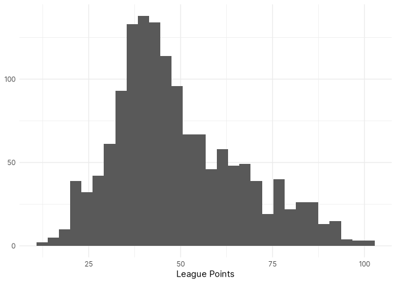

The distribution of points appears to be relatively normal with a longer
right tail, suggesting there might be some issues with extreme values.
This will be, in part, due to the different number of teams in each
league, though I think the number of games each league season plays
should be captured by a multilevel model.

## Points Distributions Across Leagues

Visualizing the distribution of all points totals across leagues and
seasons aggregates to a level that risks missing some important detail.

``` r
club_resources %>%
  ggplot(aes(pts, fill = league)) +
  geom_histogram() +
  scale_fill_viridis_d() +
  labs(x = "League Points", y = NULL) +
  theme(
    legend.position = "top",
    legend.title = element_blank()
  ) + 
  guides(fill = guide_legend(nrow = 1))
```

    `stat_bin()` using `bins = 30`. Pick better value with `binwidth`.

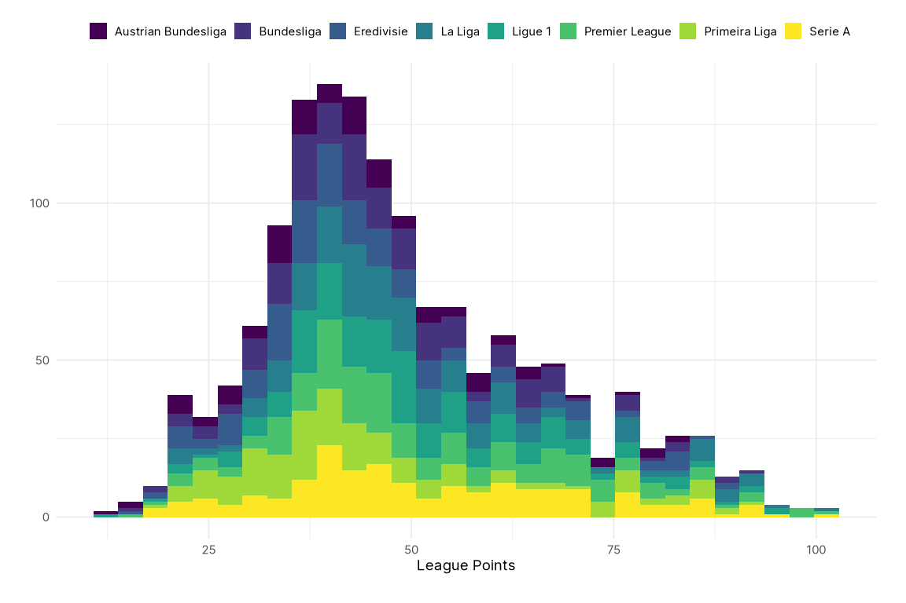

``` r
club_resources %>%
  ggplot(aes(pts, fill = league)) +
  geom_histogram(binwidth = 5) +
  scale_fill_viridis_d() +
  facet_wrap(~ league) +
  labs(x = "League Points", y = NULL) +
  theme(legend.position = "none")
```


However, facetting the points distributions by league demonstrates that
all of the leagues are a little bit right-skewed (long right tails).

How do league points vary by season? Has there been a change in the way
points are distributed over time?

``` r
club_resources %>%
  ggplot(aes(x = pts, y = forcats::as_factor(season), fill = league)) +
  ggridges::geom_density_ridges() +
  scale_fill_viridis_d() +
  facet_wrap(~ league) +
  labs(x = "League Points", y = NULL) +
  theme(
    legend.position = "none"
  )
```

    Picking joint bandwidth of 6.88

    Picking joint bandwidth of 6.52

    Picking joint bandwidth of 7.04

    Picking joint bandwidth of 7.42

    Picking joint bandwidth of 6.47

    Picking joint bandwidth of 8.65

    Picking joint bandwidth of 6.82

    Picking joint bandwidth of 8.75

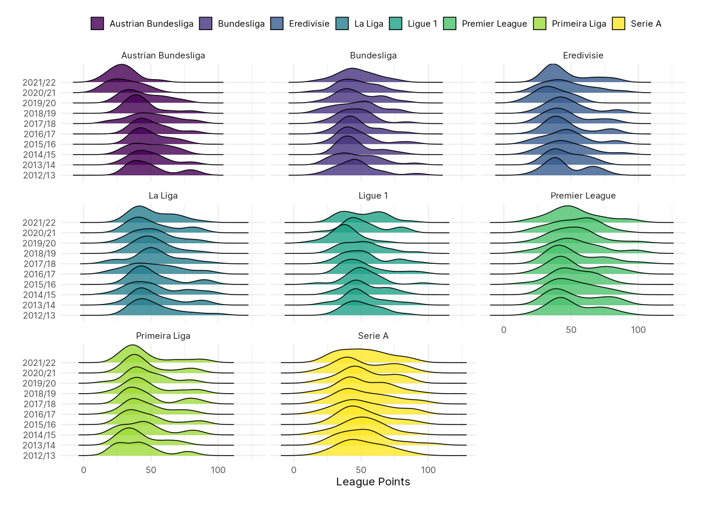

For seven of the eight leagues there doesn’t appear to be any
interesting changes in league points over time. However, there has been
a notable decline in total league points in the Austrian Bundesliga over
the last few seasons.

### The Austria Problem

``` r
club_resources %>%
  filter(league == "Austrian Bundesliga") %>%
  group_by(season) %>%
  summarise(pts = median(pts))
```

    # A tibble: 10 × 2
       season   pts
        <dbl> <dbl>
     1   2012  46.5
     2   2013  45.5
     3   2014  48  
     4   2015  45.5
     5   2016  46  
     6   2017  48.5
     7   2018  41  
     8   2019  40  
     9   2020  29.5
    10   2021  29.5

The average points drop after 2017/18, from around 45-48 points to
around 40 for a couple seasons, and then below 30 for the last two
seasons. This is because the Austrian Bundesliga expanded from 10 to 12
teams in the 20118/19 season, however, the way the league was structured
also changed. The Austrian Bundesliga now plays 22 games in a regular
season, before splitting in two, with the top six teams playing in a
“Championship playoff” and the bottom six teams playing in a “Relegation
playoff”. Each team then plays 10 games in the playoff.

The change in the league structure presents a number of problems,
however, the biggest issue of all is that there is an inconsistency in
the way FB Ref has reported league tables since the restructure. In the
first two seasons after the restructure, FB Ref reports a total league
table that includes all games played in the regular season and the
playoff rounds, totaling 32 games, and then reports a regular season
table and each of the playoff tables underneath. In the last two seasons
FB Ref has reported only the regular season table and then the two
playoff tables underneath. This means that the R package
{worldfootballR} is scraping inconsistent league table data, because it
is obviously unaware of the discrepancies in how the tables are being
reported.

Because of these inconsistencies, there is no easy fix. If the
post-restructuring league tables included all games played then I could
probably live with a small drop in total games played (from 36 to 32)
and the slight bias in points totals for mid-table teams (if a team
finishes sixth they then face tougher opponents for their final 10 games
than the team in seventh, leading to them finishing on lower points
totals despite possibly being a better team), or if it was just the
regular season tables, I could use the points per game as a standardized
measure of points per league season. That it is a little from Column A
and a little from Column B gives me few options!

As a result, I will drop the Austrian Bundesliga from the analysis, and
move forward with the seven remaining leagues. An odd number… Like some
sort of savage.

``` r
club_resources <- 
  club_resources %>%
  filter(league != "Austrian Bundesliga")
```

# Net Transfer Spending

``` r
club_resources %>%
  filter(season != 2022) %>%
  ggplot(aes(pts, net_spend, colour = league)) +
  geom_point() +
  geom_smooth(method = "lm", se = FALSE) +
  scale_colour_viridis_d() +
  scale_y_continuous(
    labels = label_number(
      style_positive = "plus",
      style_negative = "minus",
      scale_cut = cut_short_scale(),
      prefix = "€"
      )
    ) +
  facet_wrap(~ league, scales = "free", nrow = 2) +
  labs(x = NULL, y = NULL) +
  theme(
    legend.position = "top",
    legend.title = element_blank()
  ) + 
  guides(colour = guide_legend(nrow = 1))
```

    `geom_smooth()` using formula 'y ~ x'

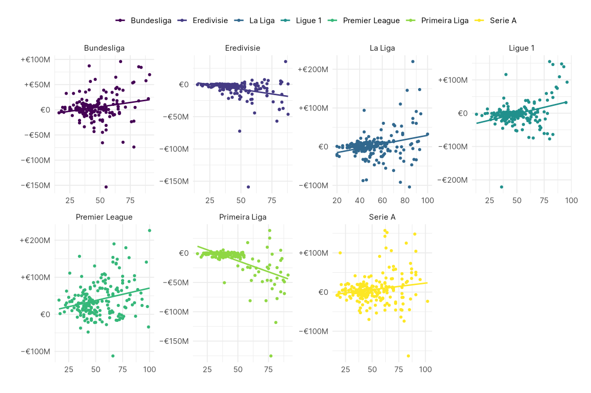

# Squad Depth

- The number of players seems to have a negative correlation with points
  (this is itself relatively interesting), but I suspect it is a
  relevant control variable.

``` r
club_resources %>%
  filter(season != 2022) %>%
  ggplot(aes(pts, num_players)) +
  geom_point() +
  geom_smooth(method = "lm", se = FALSE) +
  labs(x = "League Points", y = "Players")
```

    `geom_smooth()` using formula 'y ~ x'

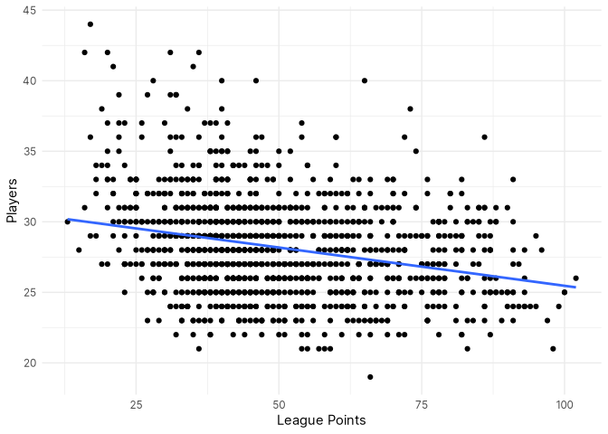

## The Relationship Between Squad Depth & Points

``` r
club_resources %>%
  filter(season != 2022) %>%
  ggplot(aes(pts, num_players, colour = league)) +
  geom_point() +
  geom_smooth(method = "lm", se = FALSE) +
  scale_colour_viridis_d() +
  labs(x = "League Points", y = "Players") +
  theme(
    legend.position = "top",
    legend.title = element_blank()
  ) + 
  guides(colour = guide_legend(nrow = 1))
```

    `geom_smooth()` using formula 'y ~ x'

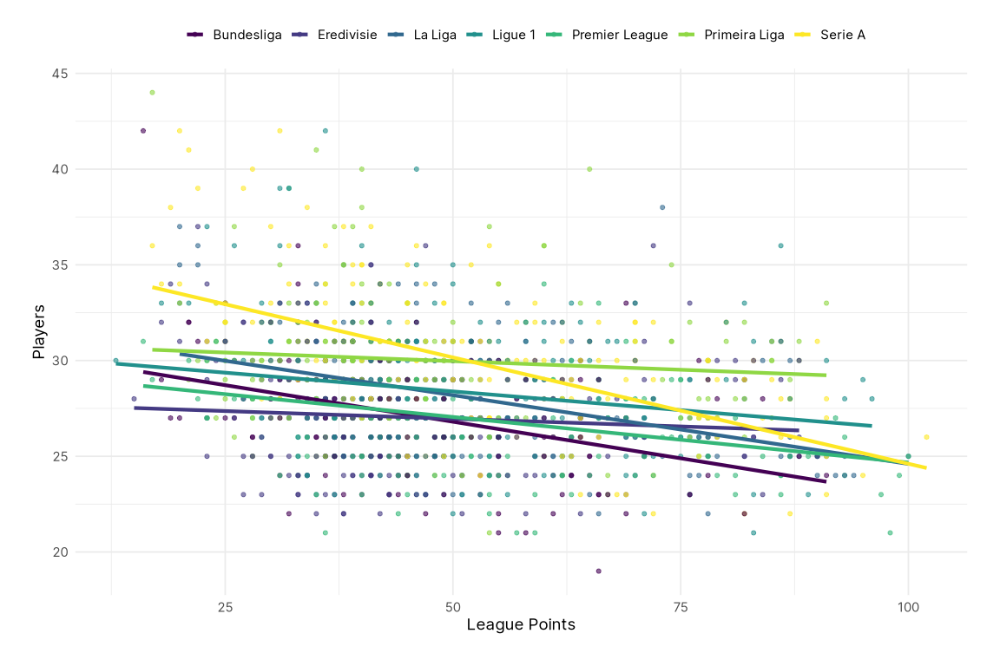

``` r
club_resources %>%
  filter(season != 2022) %>%
  ggplot(aes(pts, num_players, colour = league)) +
  geom_point() +
  geom_smooth(method = "lm", se = FALSE) +
  scale_colour_viridis_d() +
  facet_wrap(~ league, scales = "free", nrow = 2) +
  labs(x = "League Points", y = "Players") +
  theme(
    legend.position = "top",
    legend.title = element_blank()
  ) + 
  guides(colour = guide_legend(nrow = 1))
```

    `geom_smooth()` using formula 'y ~ x'

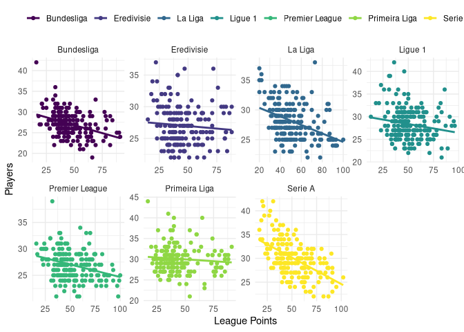

# Injuries

- The number of games missed through injury is clearly a function of the
  number of games a team plays each season, and because the injury data
  appears to include **all** games missed, not just league games, there
  is a positive relationship between points and games missed to injury.

- As a result, I’ve used days_injured instead, which is an imperfect
  measure of the effect injuries have on a team, but at least will not
  be a function of a team’s success in non-league competitions.

``` r
club_resources %>%
  filter(season != 2022) %>%
  ggplot(aes(pts, days_injured, colour = league)) +
  geom_point() +
  geom_smooth(method = "lm", se = FALSE) +
  scale_colour_viridis_d() +
  facet_wrap(~ league, scales = "free", nrow = 2) +
  labs(x = "League Points", y = "Squad Days Injured") +
  theme(
    legend.position = "top",
    legend.title = element_blank()
  ) + 
  guides(colour = guide_legend(nrow = 1))
```

    `geom_smooth()` using formula 'y ~ x'

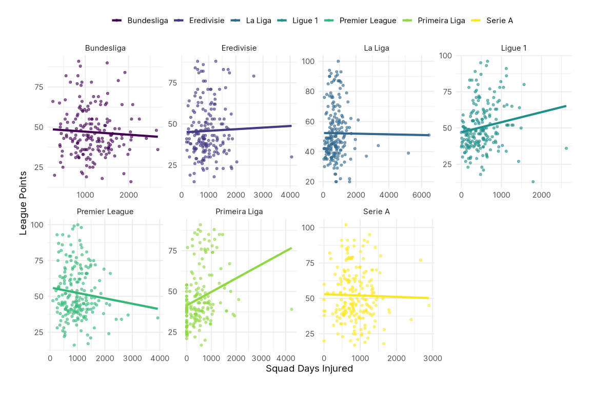

# Squad Market Values

``` r
club_resources %>%
  group_by(league, season) %>%
  summarise(value = median(value)) %>%
  ggplot(aes(forcats::as_factor(season), value, group = league, fill = league)) +
  geom_col(position = "dodge") +
  scale_fill_viridis_d() +
  scale_y_continuous(
    labels = label_number(scale_cut = cut_short_scale(), prefix = "€")
    ) +
  labs(x = NULL, y = "Squad Market Value") +
  theme(
    legend.position = "top",
    legend.title = element_blank()
  ) + 
  guides(fill = guide_legend(nrow = 1))
```

    `summarise()` has grouped output by 'league'. You can override using the
    `.groups` argument.

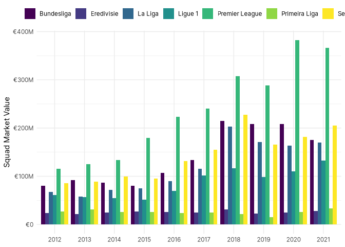

## Distributions of Squad Values Across Leagues

``` r
club_resources %>%
  ggplot(aes(x = value, y = forcats::as_factor(season), fill = league)) +
  ggridges::geom_density_ridges() +
  scale_fill_viridis_d() +
  scale_x_continuous(
    labels = label_number(
      scale_cut = cut_short_scale(),
      prefix = "€"
      )
    ) +
  facet_wrap(~ league, scales = "free", nrow = 2) +
  labs(x = NULL, y = NULL) +
  theme(
    legend.position = "top",
    legend.title = element_blank()
  ) + 
  guides(fill = guide_legend(nrow = 1))
```

    Picking joint bandwidth of 49200000

    Picking joint bandwidth of 12200000

    Picking joint bandwidth of 60700000

    Picking joint bandwidth of 35500000

    Picking joint bandwidth of 1.12e+08

    Picking joint bandwidth of 1.2e+07

    Picking joint bandwidth of 69500000

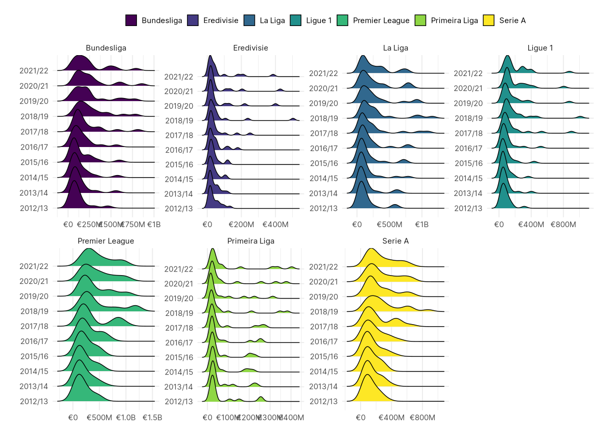

## The Relationship Between Squad Value & Points

- One of the most noticeable details that you can identify from the EDA
  is that there appears to be not only a different intercept for each
  league, but also the slope differs too. This is not entirely
  surprising, but it wasn’t my initial working assumption. I was
  starting from an assumption that the differences would be based on
  leagues having different intercepts.

- Is there also a non-linear trend in certain leagues? There does look
  like there might be an exponential relationship between market value
  and points. This may exist across all leagues, it’s just that some
  league don’t have such large disparities that that trend shows up?

- I need to facet the leagues to look at them individually as well.

- When log-transformed, there doesn’t appear to be a massive difference
  in the slopes of each league, except for the Austrian Bundesliga, and
  Ligue 1. However, I’m not sure the difference is big enough to make it
  worth modelling varying slopes.

``` r
club_resources %>%
  ggplot(aes(pts, value, colour = league)) +
  geom_point() +
  geom_smooth(method = "lm", se = FALSE) +
  scale_colour_viridis_d() +
  scale_y_continuous(
    labels = label_number(scale_cut = cut_short_scale(), prefix = "€")
    ) +
  labs(x = "League Points", y = "Squad Market Value") +
  theme(
    legend.position = "top",
    legend.title = element_blank()
  ) + 
  guides(colour = guide_legend(nrow = 1))
```

    `geom_smooth()` using formula 'y ~ x'

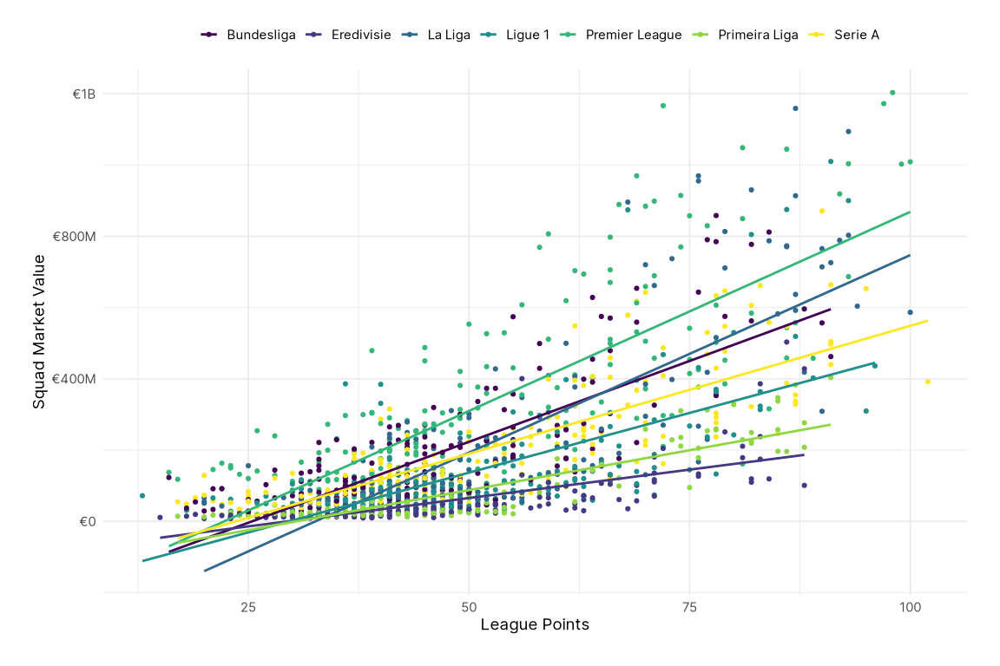

``` r
club_resources %>%
  ggplot(aes(pts, value, colour = league)) +
  geom_point() +
  geom_smooth(method = "lm", se = FALSE) +
  scale_colour_viridis_d() +
  scale_y_continuous(
    labels = label_number(scale_cut = cut_short_scale(), prefix = "€")
    ) +
  facet_wrap(~ league, scales = "free", nrow = 2) +
    labs(x = "League Points", y = "Squad Market Value") +
  theme(
    legend.position = "top",
    legend.title = element_blank()
  ) + 
  guides(colour = guide_legend(nrow = 1))
```

    `geom_smooth()` using formula 'y ~ x'

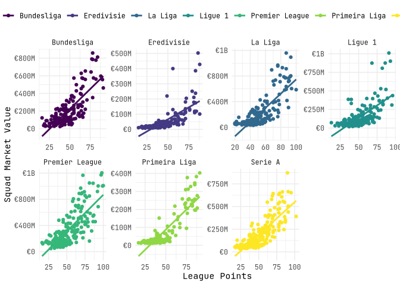
