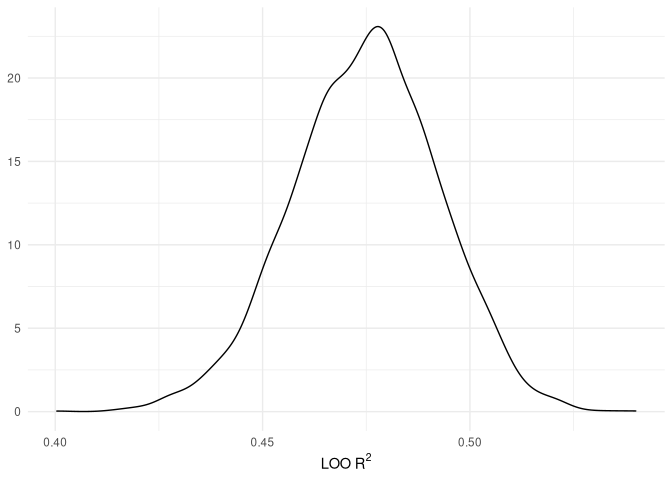
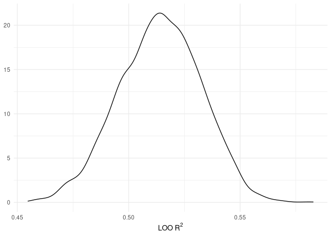
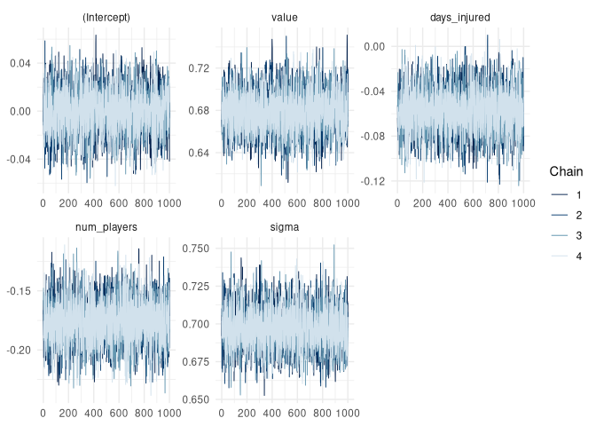
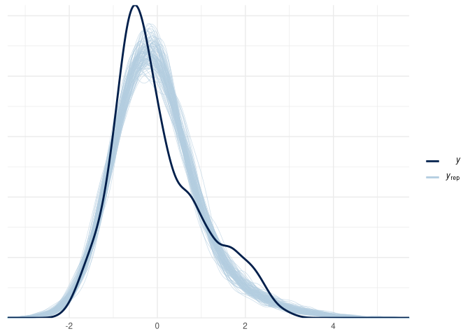
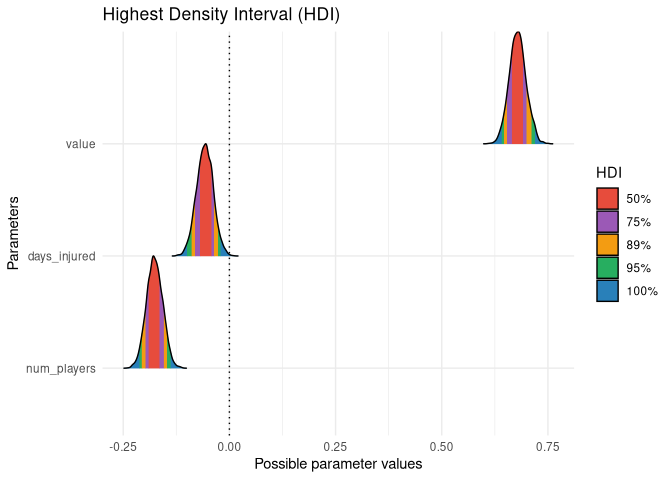
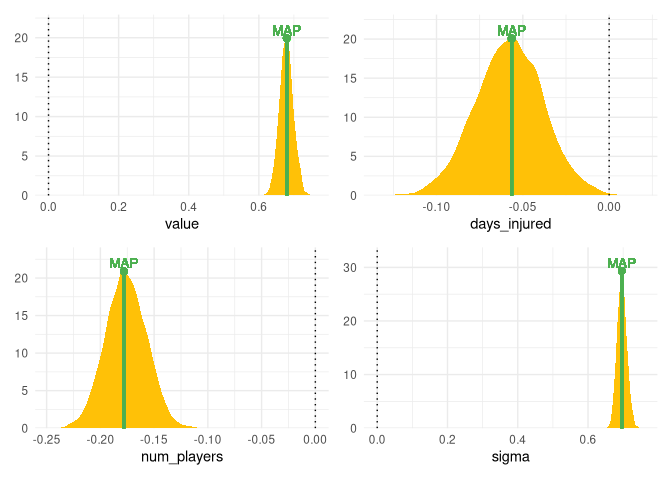

Generalized Linear Models - Regression Models as Building Blocks
================
Paul Johnson

# Preparing Data for Modelling

- Removing the Austrian Bundesliga due to issues with data quality
- Some basic transformations and type changes to make sure the data is
  ready for modelling

``` r
club_resources <-
  club_resources %>%
  filter(league != "Austrian Bundesliga") %>%
  mutate(
    weighted_injuries = days_injured/num_players,
    log_value = log(value)
  )

model_df <- 
  club_resources %>%
  mutate(
    league = forcats::as_factor(league),
    season = forcats::as_factor(season),
    squad = forcats::as_factor(squad),
    log_value = (log_value - mean(log_value))/sd(log_value),
    value = (value - mean(value))/sd(value),
    pts = (pts - mean(pts))/sd(pts),
    net_spend = (net_spend - mean(net_spend))/sd(net_spend),
    num_players = (num_players - mean(num_players))/sd(num_players),
    days_injured = (days_injured - mean(days_injured))/sd(days_injured),
    weighted_injuries = (weighted_injuries - mean(weighted_injuries))/sd(weighted_injuries)
    )
```

# Simple Linear Model with Squad Value Predictor

I should probably give these models more informative names, but the
naming structure is going to lead to some very long model names and that
irritates me in an entirely irrational way, so instead I’ve plucked for
the much less informative and objectively bad choice that doesn’t annoy
me.

``` r
glm1 <- stan_glm(pts ~ log_value, data = model_df)
```


    SAMPLING FOR MODEL 'continuous' NOW (CHAIN 1).
    Chain 1: 
    Chain 1: Gradient evaluation took 0.000126 seconds
    Chain 1: 1000 transitions using 10 leapfrog steps per transition would take 1.26 seconds.
    Chain 1: Adjust your expectations accordingly!
    Chain 1: 
    Chain 1: 
    Chain 1: Iteration:    1 / 2000 [  0%]  (Warmup)
    Chain 1: Iteration:  200 / 2000 [ 10%]  (Warmup)
    Chain 1: Iteration:  400 / 2000 [ 20%]  (Warmup)
    Chain 1: Iteration:  600 / 2000 [ 30%]  (Warmup)
    Chain 1: Iteration:  800 / 2000 [ 40%]  (Warmup)
    Chain 1: Iteration: 1000 / 2000 [ 50%]  (Warmup)
    Chain 1: Iteration: 1001 / 2000 [ 50%]  (Sampling)
    Chain 1: Iteration: 1200 / 2000 [ 60%]  (Sampling)
    Chain 1: Iteration: 1400 / 2000 [ 70%]  (Sampling)
    Chain 1: Iteration: 1600 / 2000 [ 80%]  (Sampling)
    Chain 1: Iteration: 1800 / 2000 [ 90%]  (Sampling)
    Chain 1: Iteration: 2000 / 2000 [100%]  (Sampling)
    Chain 1: 
    Chain 1:  Elapsed Time: 0.025288 seconds (Warm-up)
    Chain 1:                0.147871 seconds (Sampling)
    Chain 1:                0.173159 seconds (Total)
    Chain 1: 

    SAMPLING FOR MODEL 'continuous' NOW (CHAIN 2).
    Chain 2: 
    Chain 2: Gradient evaluation took 1.6e-05 seconds
    Chain 2: 1000 transitions using 10 leapfrog steps per transition would take 0.16 seconds.
    Chain 2: Adjust your expectations accordingly!
    Chain 2: 
    Chain 2: 
    Chain 2: Iteration:    1 / 2000 [  0%]  (Warmup)
    Chain 2: Iteration:  200 / 2000 [ 10%]  (Warmup)
    Chain 2: Iteration:  400 / 2000 [ 20%]  (Warmup)
    Chain 2: Iteration:  600 / 2000 [ 30%]  (Warmup)
    Chain 2: Iteration:  800 / 2000 [ 40%]  (Warmup)
    Chain 2: Iteration: 1000 / 2000 [ 50%]  (Warmup)
    Chain 2: Iteration: 1001 / 2000 [ 50%]  (Sampling)
    Chain 2: Iteration: 1200 / 2000 [ 60%]  (Sampling)
    Chain 2: Iteration: 1400 / 2000 [ 70%]  (Sampling)
    Chain 2: Iteration: 1600 / 2000 [ 80%]  (Sampling)
    Chain 2: Iteration: 1800 / 2000 [ 90%]  (Sampling)
    Chain 2: Iteration: 2000 / 2000 [100%]  (Sampling)
    Chain 2: 
    Chain 2:  Elapsed Time: 0.02779 seconds (Warm-up)
    Chain 2:                0.170386 seconds (Sampling)
    Chain 2:                0.198176 seconds (Total)
    Chain 2: 

    SAMPLING FOR MODEL 'continuous' NOW (CHAIN 3).
    Chain 3: 
    Chain 3: Gradient evaluation took 9e-06 seconds
    Chain 3: 1000 transitions using 10 leapfrog steps per transition would take 0.09 seconds.
    Chain 3: Adjust your expectations accordingly!
    Chain 3: 
    Chain 3: 
    Chain 3: Iteration:    1 / 2000 [  0%]  (Warmup)
    Chain 3: Iteration:  200 / 2000 [ 10%]  (Warmup)
    Chain 3: Iteration:  400 / 2000 [ 20%]  (Warmup)
    Chain 3: Iteration:  600 / 2000 [ 30%]  (Warmup)
    Chain 3: Iteration:  800 / 2000 [ 40%]  (Warmup)
    Chain 3: Iteration: 1000 / 2000 [ 50%]  (Warmup)
    Chain 3: Iteration: 1001 / 2000 [ 50%]  (Sampling)
    Chain 3: Iteration: 1200 / 2000 [ 60%]  (Sampling)
    Chain 3: Iteration: 1400 / 2000 [ 70%]  (Sampling)
    Chain 3: Iteration: 1600 / 2000 [ 80%]  (Sampling)
    Chain 3: Iteration: 1800 / 2000 [ 90%]  (Sampling)
    Chain 3: Iteration: 2000 / 2000 [100%]  (Sampling)
    Chain 3: 
    Chain 3:  Elapsed Time: 0.023245 seconds (Warm-up)
    Chain 3:                0.126281 seconds (Sampling)
    Chain 3:                0.149526 seconds (Total)
    Chain 3: 

    SAMPLING FOR MODEL 'continuous' NOW (CHAIN 4).
    Chain 4: 
    Chain 4: Gradient evaluation took 9e-06 seconds
    Chain 4: 1000 transitions using 10 leapfrog steps per transition would take 0.09 seconds.
    Chain 4: Adjust your expectations accordingly!
    Chain 4: 
    Chain 4: 
    Chain 4: Iteration:    1 / 2000 [  0%]  (Warmup)
    Chain 4: Iteration:  200 / 2000 [ 10%]  (Warmup)
    Chain 4: Iteration:  400 / 2000 [ 20%]  (Warmup)
    Chain 4: Iteration:  600 / 2000 [ 30%]  (Warmup)
    Chain 4: Iteration:  800 / 2000 [ 40%]  (Warmup)
    Chain 4: Iteration: 1000 / 2000 [ 50%]  (Warmup)
    Chain 4: Iteration: 1001 / 2000 [ 50%]  (Sampling)
    Chain 4: Iteration: 1200 / 2000 [ 60%]  (Sampling)
    Chain 4: Iteration: 1400 / 2000 [ 70%]  (Sampling)
    Chain 4: Iteration: 1600 / 2000 [ 80%]  (Sampling)
    Chain 4: Iteration: 1800 / 2000 [ 90%]  (Sampling)
    Chain 4: Iteration: 2000 / 2000 [100%]  (Sampling)
    Chain 4: 
    Chain 4:  Elapsed Time: 0.020221 seconds (Warm-up)
    Chain 4:                0.12915 seconds (Sampling)
    Chain 4:                0.149371 seconds (Total)
    Chain 4: 

``` r
print(glm1)
```

    stan_glm
     family:       gaussian [identity]
     formula:      pts ~ log_value
     observations: 1336
     predictors:   2
    ------
                Median MAD_SD
    (Intercept) 0.0    0.0   
    log_value   0.7    0.0   

    Auxiliary parameter(s):
          Median MAD_SD
    sigma 0.7    0.0   

    ------
    * For help interpreting the printed output see ?print.stanreg
    * For info on the priors used see ?prior_summary.stanreg

``` r
value_R2 <- loo_R2(glm1)

median(value_R2)
```

    [1] 0.4754757

``` r
as_tibble(value_R2) %>%
  ggplot(aes(value)) +
  geom_density() +
  labs(x = expression("LOO R"^2), y = NULL)
```



The LOO $R^2$ is much better for the regression including squad values
than the intercept only regression. This is to be expected, but it does
help to check these things!

The multivariate regression including all potential explanatory
variables is also a little better than the model that only contains the
squad values as a predictor. The improvement isn’t huge, but it’s
significant enough to suggest there’s value in including some of those
variables.

# Multiple Linear Regression

``` r
glm2 <- stan_glm(pts ~ value + days_injured + num_players, data = model_df)
```


    SAMPLING FOR MODEL 'continuous' NOW (CHAIN 1).
    Chain 1: 
    Chain 1: Gradient evaluation took 2.2e-05 seconds
    Chain 1: 1000 transitions using 10 leapfrog steps per transition would take 0.22 seconds.
    Chain 1: Adjust your expectations accordingly!
    Chain 1: 
    Chain 1: 
    Chain 1: Iteration:    1 / 2000 [  0%]  (Warmup)
    Chain 1: Iteration:  200 / 2000 [ 10%]  (Warmup)
    Chain 1: Iteration:  400 / 2000 [ 20%]  (Warmup)
    Chain 1: Iteration:  600 / 2000 [ 30%]  (Warmup)
    Chain 1: Iteration:  800 / 2000 [ 40%]  (Warmup)
    Chain 1: Iteration: 1000 / 2000 [ 50%]  (Warmup)
    Chain 1: Iteration: 1001 / 2000 [ 50%]  (Sampling)
    Chain 1: Iteration: 1200 / 2000 [ 60%]  (Sampling)
    Chain 1: Iteration: 1400 / 2000 [ 70%]  (Sampling)
    Chain 1: Iteration: 1600 / 2000 [ 80%]  (Sampling)
    Chain 1: Iteration: 1800 / 2000 [ 90%]  (Sampling)
    Chain 1: Iteration: 2000 / 2000 [100%]  (Sampling)
    Chain 1: 
    Chain 1:  Elapsed Time: 0.035508 seconds (Warm-up)
    Chain 1:                0.170851 seconds (Sampling)
    Chain 1:                0.206359 seconds (Total)
    Chain 1: 

    SAMPLING FOR MODEL 'continuous' NOW (CHAIN 2).
    Chain 2: 
    Chain 2: Gradient evaluation took 1.5e-05 seconds
    Chain 2: 1000 transitions using 10 leapfrog steps per transition would take 0.15 seconds.
    Chain 2: Adjust your expectations accordingly!
    Chain 2: 
    Chain 2: 
    Chain 2: Iteration:    1 / 2000 [  0%]  (Warmup)
    Chain 2: Iteration:  200 / 2000 [ 10%]  (Warmup)
    Chain 2: Iteration:  400 / 2000 [ 20%]  (Warmup)
    Chain 2: Iteration:  600 / 2000 [ 30%]  (Warmup)
    Chain 2: Iteration:  800 / 2000 [ 40%]  (Warmup)
    Chain 2: Iteration: 1000 / 2000 [ 50%]  (Warmup)
    Chain 2: Iteration: 1001 / 2000 [ 50%]  (Sampling)
    Chain 2: Iteration: 1200 / 2000 [ 60%]  (Sampling)
    Chain 2: Iteration: 1400 / 2000 [ 70%]  (Sampling)
    Chain 2: Iteration: 1600 / 2000 [ 80%]  (Sampling)
    Chain 2: Iteration: 1800 / 2000 [ 90%]  (Sampling)
    Chain 2: Iteration: 2000 / 2000 [100%]  (Sampling)
    Chain 2: 
    Chain 2:  Elapsed Time: 0.032657 seconds (Warm-up)
    Chain 2:                0.155947 seconds (Sampling)
    Chain 2:                0.188604 seconds (Total)
    Chain 2: 

    SAMPLING FOR MODEL 'continuous' NOW (CHAIN 3).
    Chain 3: 
    Chain 3: Gradient evaluation took 2.8e-05 seconds
    Chain 3: 1000 transitions using 10 leapfrog steps per transition would take 0.28 seconds.
    Chain 3: Adjust your expectations accordingly!
    Chain 3: 
    Chain 3: 
    Chain 3: Iteration:    1 / 2000 [  0%]  (Warmup)
    Chain 3: Iteration:  200 / 2000 [ 10%]  (Warmup)
    Chain 3: Iteration:  400 / 2000 [ 20%]  (Warmup)
    Chain 3: Iteration:  600 / 2000 [ 30%]  (Warmup)
    Chain 3: Iteration:  800 / 2000 [ 40%]  (Warmup)
    Chain 3: Iteration: 1000 / 2000 [ 50%]  (Warmup)
    Chain 3: Iteration: 1001 / 2000 [ 50%]  (Sampling)
    Chain 3: Iteration: 1200 / 2000 [ 60%]  (Sampling)
    Chain 3: Iteration: 1400 / 2000 [ 70%]  (Sampling)
    Chain 3: Iteration: 1600 / 2000 [ 80%]  (Sampling)
    Chain 3: Iteration: 1800 / 2000 [ 90%]  (Sampling)
    Chain 3: Iteration: 2000 / 2000 [100%]  (Sampling)
    Chain 3: 
    Chain 3:  Elapsed Time: 0.026695 seconds (Warm-up)
    Chain 3:                0.142572 seconds (Sampling)
    Chain 3:                0.169267 seconds (Total)
    Chain 3: 

    SAMPLING FOR MODEL 'continuous' NOW (CHAIN 4).
    Chain 4: 
    Chain 4: Gradient evaluation took 1e-05 seconds
    Chain 4: 1000 transitions using 10 leapfrog steps per transition would take 0.1 seconds.
    Chain 4: Adjust your expectations accordingly!
    Chain 4: 
    Chain 4: 
    Chain 4: Iteration:    1 / 2000 [  0%]  (Warmup)
    Chain 4: Iteration:  200 / 2000 [ 10%]  (Warmup)
    Chain 4: Iteration:  400 / 2000 [ 20%]  (Warmup)
    Chain 4: Iteration:  600 / 2000 [ 30%]  (Warmup)
    Chain 4: Iteration:  800 / 2000 [ 40%]  (Warmup)
    Chain 4: Iteration: 1000 / 2000 [ 50%]  (Warmup)
    Chain 4: Iteration: 1001 / 2000 [ 50%]  (Sampling)
    Chain 4: Iteration: 1200 / 2000 [ 60%]  (Sampling)
    Chain 4: Iteration: 1400 / 2000 [ 70%]  (Sampling)
    Chain 4: Iteration: 1600 / 2000 [ 80%]  (Sampling)
    Chain 4: Iteration: 1800 / 2000 [ 90%]  (Sampling)
    Chain 4: Iteration: 2000 / 2000 [100%]  (Sampling)
    Chain 4: 
    Chain 4:  Elapsed Time: 0.028433 seconds (Warm-up)
    Chain 4:                0.14414 seconds (Sampling)
    Chain 4:                0.172573 seconds (Total)
    Chain 4: 

``` r
print(glm2)
```

    stan_glm
     family:       gaussian [identity]
     formula:      pts ~ value + days_injured + num_players
     observations: 1336
     predictors:   4
    ------
                 Median MAD_SD
    (Intercept)   0.0    0.0  
    value         0.7    0.0  
    days_injured -0.1    0.0  
    num_players  -0.2    0.0  

    Auxiliary parameter(s):
          Median MAD_SD
    sigma 0.7    0.0   

    ------
    * For help interpreting the printed output see ?print.stanreg
    * For info on the priors used see ?prior_summary.stanreg

``` r
median(loo_R2(glm2))
```

    [1] 0.5144224

``` r
as_tibble(loo_R2(glm2)) %>%
  ggplot(aes(value)) +
  geom_density() +
  labs(x = expression("LOO R"^2), y = NULL)
```



We can also carry out some diagnostic checks and some posterior
predictive checks.

``` r
bayesplot::mcmc_trace(glm2) 
```



``` r
bayesplot::ppc_dens_overlay(
  y = glm2$y,
  yrep = posterior_predict(
    glm2,
    draws = 100
    )
)
```



``` r
bayestestR::hdi(
  glm2,
  ci = c(
    0.5, 0.75, 0.89, 0.95
    )
  ) %>%
  plot()
```



``` r
multivariate_posterior <- as.matrix(glm2)

bayestestR::map_estimate(
  multivariate_posterior
  ) %>%
  plot()
```


