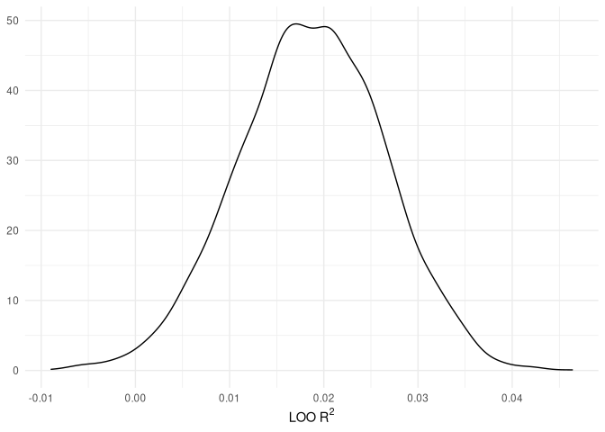
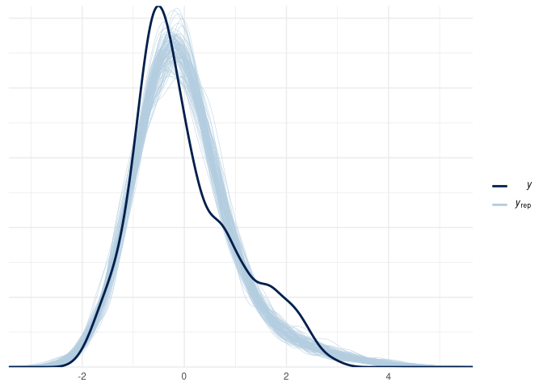
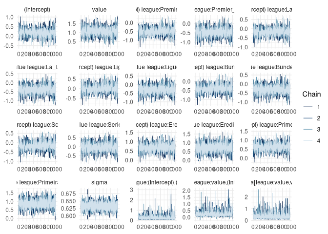
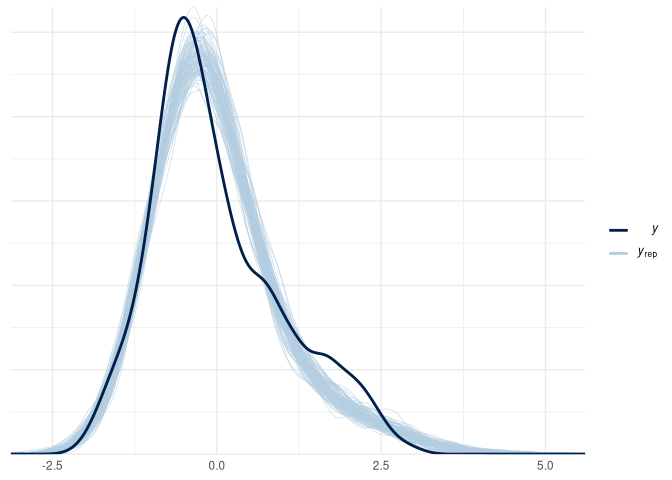
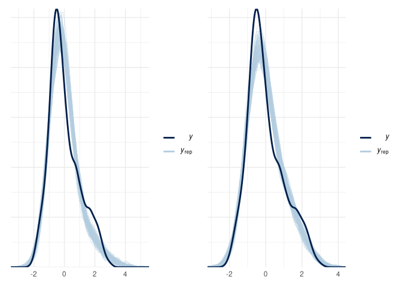

Bayesian Multilevel Regression - Are Bayern Munich Good or is the
Bundesliga Bad?
================
Paul Johnson

``` r
suppressPackageStartupMessages({
  library(dplyr)
  library(ggplot2)
  library(scales)
  library(patchwork)
  library(rstanarm)
})

theme_set(theme_minimal())

club_resources <- readr::read_rds(here::here("data", "club_resources.rds"))
```

Data often contain hierarchical or group structures that leads to a
structural dependence within-group. That makes modelling the data in a
flat structure difficult, because there will be correlated errors within
each group.

The classic example of a hierarchical data structure is student test
results, nested within different schools or within different classes.
You would expect there to be a correlation between results within a
certain school or class, as teaching methods, resources, and other
group-level factors effect students learning and subsequent test
results. In order to get a more accurate picture of

This can be resolved using the model of many names, such as multilevel
models, mixed effects models, or hierarchical models.[^1]

Multilevel models…

# Preparing Data for Modelling

- Removing the Austrian Bundesliga due to issues with data quality
- Some basic transformations and type changes to make sure the data is
  ready for modelling

``` r
club_resources <-
  club_resources %>%
  filter(league != "Austrian Bundesliga") %>%
  mutate(
    weighted_injuries = days_injured/num_players,
    log_value = log(value)
  )

model_df <- 
  club_resources %>%
  mutate(
    league = forcats::as_factor(league),
    season = forcats::as_factor(season),
    squad = forcats::as_factor(squad),
    log_value = (log_value - mean(log_value))/sd(log_value),
    value = (value - mean(value))/sd(value),
    pts = (pts - mean(pts))/sd(pts),
    net_spend = (net_spend - mean(net_spend))/sd(net_spend),
    num_players = (num_players - mean(num_players))/sd(num_players),
    days_injured = (days_injured - mean(days_injured))/sd(days_injured),
    weighted_injuries = (weighted_injuries - mean(weighted_injuries))/sd(weighted_injuries)
    )
```

# Multilevel Regression

## Varying Intercepts Model with No Predictors

- So the log(value) models perform slightly worse than the
  non-transformed models, in terms of $Loo R^2$. Is this because there
  is less variance to explain?
- I need to give this some thought and explain what is driving this
  issue.

``` r
lmer1 <-
  stan_lmer(pts ~ 1 + (1 | league),
      data = model_df)  
```


    SAMPLING FOR MODEL 'continuous' NOW (CHAIN 1).
    Chain 1: 
    Chain 1: Gradient evaluation took 0.000137 seconds
    Chain 1: 1000 transitions using 10 leapfrog steps per transition would take 1.37 seconds.
    Chain 1: Adjust your expectations accordingly!
    Chain 1: 
    Chain 1: 
    Chain 1: Iteration:    1 / 2000 [  0%]  (Warmup)
    Chain 1: Iteration:  200 / 2000 [ 10%]  (Warmup)
    Chain 1: Iteration:  400 / 2000 [ 20%]  (Warmup)
    Chain 1: Iteration:  600 / 2000 [ 30%]  (Warmup)
    Chain 1: Iteration:  800 / 2000 [ 40%]  (Warmup)
    Chain 1: Iteration: 1000 / 2000 [ 50%]  (Warmup)
    Chain 1: Iteration: 1001 / 2000 [ 50%]  (Sampling)
    Chain 1: Iteration: 1200 / 2000 [ 60%]  (Sampling)
    Chain 1: Iteration: 1400 / 2000 [ 70%]  (Sampling)
    Chain 1: Iteration: 1600 / 2000 [ 80%]  (Sampling)
    Chain 1: Iteration: 1800 / 2000 [ 90%]  (Sampling)
    Chain 1: Iteration: 2000 / 2000 [100%]  (Sampling)
    Chain 1: 
    Chain 1:  Elapsed Time: 3.65383 seconds (Warm-up)
    Chain 1:                2.11659 seconds (Sampling)
    Chain 1:                5.77043 seconds (Total)
    Chain 1: 

    SAMPLING FOR MODEL 'continuous' NOW (CHAIN 2).
    Chain 2: 
    Chain 2: Gradient evaluation took 8.2e-05 seconds
    Chain 2: 1000 transitions using 10 leapfrog steps per transition would take 0.82 seconds.
    Chain 2: Adjust your expectations accordingly!
    Chain 2: 
    Chain 2: 
    Chain 2: Iteration:    1 / 2000 [  0%]  (Warmup)
    Chain 2: Iteration:  200 / 2000 [ 10%]  (Warmup)
    Chain 2: Iteration:  400 / 2000 [ 20%]  (Warmup)
    Chain 2: Iteration:  600 / 2000 [ 30%]  (Warmup)
    Chain 2: Iteration:  800 / 2000 [ 40%]  (Warmup)
    Chain 2: Iteration: 1000 / 2000 [ 50%]  (Warmup)
    Chain 2: Iteration: 1001 / 2000 [ 50%]  (Sampling)
    Chain 2: Iteration: 1200 / 2000 [ 60%]  (Sampling)
    Chain 2: Iteration: 1400 / 2000 [ 70%]  (Sampling)
    Chain 2: Iteration: 1600 / 2000 [ 80%]  (Sampling)
    Chain 2: Iteration: 1800 / 2000 [ 90%]  (Sampling)
    Chain 2: Iteration: 2000 / 2000 [100%]  (Sampling)
    Chain 2: 
    Chain 2:  Elapsed Time: 3.32903 seconds (Warm-up)
    Chain 2:                2.40977 seconds (Sampling)
    Chain 2:                5.7388 seconds (Total)
    Chain 2: 

    SAMPLING FOR MODEL 'continuous' NOW (CHAIN 3).
    Chain 3: 
    Chain 3: Gradient evaluation took 8e-05 seconds
    Chain 3: 1000 transitions using 10 leapfrog steps per transition would take 0.8 seconds.
    Chain 3: Adjust your expectations accordingly!
    Chain 3: 
    Chain 3: 
    Chain 3: Iteration:    1 / 2000 [  0%]  (Warmup)
    Chain 3: Iteration:  200 / 2000 [ 10%]  (Warmup)
    Chain 3: Iteration:  400 / 2000 [ 20%]  (Warmup)
    Chain 3: Iteration:  600 / 2000 [ 30%]  (Warmup)
    Chain 3: Iteration:  800 / 2000 [ 40%]  (Warmup)
    Chain 3: Iteration: 1000 / 2000 [ 50%]  (Warmup)
    Chain 3: Iteration: 1001 / 2000 [ 50%]  (Sampling)
    Chain 3: Iteration: 1200 / 2000 [ 60%]  (Sampling)
    Chain 3: Iteration: 1400 / 2000 [ 70%]  (Sampling)
    Chain 3: Iteration: 1600 / 2000 [ 80%]  (Sampling)
    Chain 3: Iteration: 1800 / 2000 [ 90%]  (Sampling)
    Chain 3: Iteration: 2000 / 2000 [100%]  (Sampling)
    Chain 3: 
    Chain 3:  Elapsed Time: 2.44549 seconds (Warm-up)
    Chain 3:                1.79108 seconds (Sampling)
    Chain 3:                4.23657 seconds (Total)
    Chain 3: 

    SAMPLING FOR MODEL 'continuous' NOW (CHAIN 4).
    Chain 4: 
    Chain 4: Gradient evaluation took 8.2e-05 seconds
    Chain 4: 1000 transitions using 10 leapfrog steps per transition would take 0.82 seconds.
    Chain 4: Adjust your expectations accordingly!
    Chain 4: 
    Chain 4: 
    Chain 4: Iteration:    1 / 2000 [  0%]  (Warmup)
    Chain 4: Iteration:  200 / 2000 [ 10%]  (Warmup)
    Chain 4: Iteration:  400 / 2000 [ 20%]  (Warmup)
    Chain 4: Iteration:  600 / 2000 [ 30%]  (Warmup)
    Chain 4: Iteration:  800 / 2000 [ 40%]  (Warmup)
    Chain 4: Iteration: 1000 / 2000 [ 50%]  (Warmup)
    Chain 4: Iteration: 1001 / 2000 [ 50%]  (Sampling)
    Chain 4: Iteration: 1200 / 2000 [ 60%]  (Sampling)
    Chain 4: Iteration: 1400 / 2000 [ 70%]  (Sampling)
    Chain 4: Iteration: 1600 / 2000 [ 80%]  (Sampling)
    Chain 4: Iteration: 1800 / 2000 [ 90%]  (Sampling)
    Chain 4: Iteration: 2000 / 2000 [100%]  (Sampling)
    Chain 4: 
    Chain 4:  Elapsed Time: 2.47267 seconds (Warm-up)
    Chain 4:                1.91954 seconds (Sampling)
    Chain 4:                4.39222 seconds (Total)
    Chain 4: 

``` r
print(lmer1)
```

    stan_lmer
     family:       gaussian [identity]
     formula:      pts ~ 1 + (1 | league)
     observations: 1336
    ------
                Median MAD_SD
    (Intercept) 0.0    0.1   

    Auxiliary parameter(s):
          Median MAD_SD
    sigma 1.0    0.0   

    Error terms:
     Groups   Name        Std.Dev.
     league   (Intercept) 0.23    
     Residual             0.99    
    Num. levels: league 7 

    ------
    * For help interpreting the printed output see ?print.stanreg
    * For info on the priors used see ?prior_summary.stanreg

``` r
median(loo_R2(lmer1))
```

    [1] 0.01876386

``` r
as_tibble(loo_R2(lmer1)) %>%
  ggplot(aes(value)) +
  geom_density() +
  labs(x = expression("LOO R"^2), y = NULL)
```



## Varying Intercepts Model with Squad Value Predictor

``` r
lmer2 <- 
  stan_lmer(pts ~ 1 + value + (1|league), data = model_df)
```


    SAMPLING FOR MODEL 'continuous' NOW (CHAIN 1).
    Chain 1: 
    Chain 1: Gradient evaluation took 0.000223 seconds
    Chain 1: 1000 transitions using 10 leapfrog steps per transition would take 2.23 seconds.
    Chain 1: Adjust your expectations accordingly!
    Chain 1: 
    Chain 1: 
    Chain 1: Iteration:    1 / 2000 [  0%]  (Warmup)
    Chain 1: Iteration:  200 / 2000 [ 10%]  (Warmup)
    Chain 1: Iteration:  400 / 2000 [ 20%]  (Warmup)
    Chain 1: Iteration:  600 / 2000 [ 30%]  (Warmup)
    Chain 1: Iteration:  800 / 2000 [ 40%]  (Warmup)
    Chain 1: Iteration: 1000 / 2000 [ 50%]  (Warmup)
    Chain 1: Iteration: 1001 / 2000 [ 50%]  (Sampling)
    Chain 1: Iteration: 1200 / 2000 [ 60%]  (Sampling)
    Chain 1: Iteration: 1400 / 2000 [ 70%]  (Sampling)
    Chain 1: Iteration: 1600 / 2000 [ 80%]  (Sampling)
    Chain 1: Iteration: 1800 / 2000 [ 90%]  (Sampling)
    Chain 1: Iteration: 2000 / 2000 [100%]  (Sampling)
    Chain 1: 
    Chain 1:  Elapsed Time: 5.85456 seconds (Warm-up)
    Chain 1:                4.52864 seconds (Sampling)
    Chain 1:                10.3832 seconds (Total)
    Chain 1: 

    SAMPLING FOR MODEL 'continuous' NOW (CHAIN 2).
    Chain 2: 
    Chain 2: Gradient evaluation took 9.1e-05 seconds
    Chain 2: 1000 transitions using 10 leapfrog steps per transition would take 0.91 seconds.
    Chain 2: Adjust your expectations accordingly!
    Chain 2: 
    Chain 2: 
    Chain 2: Iteration:    1 / 2000 [  0%]  (Warmup)
    Chain 2: Iteration:  200 / 2000 [ 10%]  (Warmup)
    Chain 2: Iteration:  400 / 2000 [ 20%]  (Warmup)
    Chain 2: Iteration:  600 / 2000 [ 30%]  (Warmup)
    Chain 2: Iteration:  800 / 2000 [ 40%]  (Warmup)
    Chain 2: Iteration: 1000 / 2000 [ 50%]  (Warmup)
    Chain 2: Iteration: 1001 / 2000 [ 50%]  (Sampling)
    Chain 2: Iteration: 1200 / 2000 [ 60%]  (Sampling)
    Chain 2: Iteration: 1400 / 2000 [ 70%]  (Sampling)
    Chain 2: Iteration: 1600 / 2000 [ 80%]  (Sampling)
    Chain 2: Iteration: 1800 / 2000 [ 90%]  (Sampling)
    Chain 2: Iteration: 2000 / 2000 [100%]  (Sampling)
    Chain 2: 
    Chain 2:  Elapsed Time: 4.82896 seconds (Warm-up)
    Chain 2:                4.13068 seconds (Sampling)
    Chain 2:                8.95965 seconds (Total)
    Chain 2: 

    SAMPLING FOR MODEL 'continuous' NOW (CHAIN 3).
    Chain 3: 
    Chain 3: Gradient evaluation took 9.3e-05 seconds
    Chain 3: 1000 transitions using 10 leapfrog steps per transition would take 0.93 seconds.
    Chain 3: Adjust your expectations accordingly!
    Chain 3: 
    Chain 3: 
    Chain 3: Iteration:    1 / 2000 [  0%]  (Warmup)
    Chain 3: Iteration:  200 / 2000 [ 10%]  (Warmup)
    Chain 3: Iteration:  400 / 2000 [ 20%]  (Warmup)
    Chain 3: Iteration:  600 / 2000 [ 30%]  (Warmup)
    Chain 3: Iteration:  800 / 2000 [ 40%]  (Warmup)
    Chain 3: Iteration: 1000 / 2000 [ 50%]  (Warmup)
    Chain 3: Iteration: 1001 / 2000 [ 50%]  (Sampling)
    Chain 3: Iteration: 1200 / 2000 [ 60%]  (Sampling)
    Chain 3: Iteration: 1400 / 2000 [ 70%]  (Sampling)
    Chain 3: Iteration: 1600 / 2000 [ 80%]  (Sampling)
    Chain 3: Iteration: 1800 / 2000 [ 90%]  (Sampling)
    Chain 3: Iteration: 2000 / 2000 [100%]  (Sampling)
    Chain 3: 
    Chain 3:  Elapsed Time: 5.20747 seconds (Warm-up)
    Chain 3:                4.32998 seconds (Sampling)
    Chain 3:                9.53745 seconds (Total)
    Chain 3: 

    SAMPLING FOR MODEL 'continuous' NOW (CHAIN 4).
    Chain 4: 
    Chain 4: Gradient evaluation took 9.4e-05 seconds
    Chain 4: 1000 transitions using 10 leapfrog steps per transition would take 0.94 seconds.
    Chain 4: Adjust your expectations accordingly!
    Chain 4: 
    Chain 4: 
    Chain 4: Iteration:    1 / 2000 [  0%]  (Warmup)
    Chain 4: Iteration:  200 / 2000 [ 10%]  (Warmup)
    Chain 4: Iteration:  400 / 2000 [ 20%]  (Warmup)
    Chain 4: Iteration:  600 / 2000 [ 30%]  (Warmup)
    Chain 4: Iteration:  800 / 2000 [ 40%]  (Warmup)
    Chain 4: Iteration: 1000 / 2000 [ 50%]  (Warmup)
    Chain 4: Iteration: 1001 / 2000 [ 50%]  (Sampling)
    Chain 4: Iteration: 1200 / 2000 [ 60%]  (Sampling)
    Chain 4: Iteration: 1400 / 2000 [ 70%]  (Sampling)
    Chain 4: Iteration: 1600 / 2000 [ 80%]  (Sampling)
    Chain 4: Iteration: 1800 / 2000 [ 90%]  (Sampling)
    Chain 4: Iteration: 2000 / 2000 [100%]  (Sampling)
    Chain 4: 
    Chain 4:  Elapsed Time: 5.37467 seconds (Warm-up)
    Chain 4:                3.56945 seconds (Sampling)
    Chain 4:                8.94413 seconds (Total)
    Chain 4: 

``` r
print(lmer2)
```

    stan_lmer
     family:       gaussian [identity]
     formula:      pts ~ 1 + value + (1 | league)
     observations: 1336
    ------
                Median MAD_SD
    (Intercept) 0.0    0.1   
    value       0.8    0.0   

    Auxiliary parameter(s):
          Median MAD_SD
    sigma 0.7    0.0   

    Error terms:
     Groups   Name        Std.Dev.
     league   (Intercept) 0.34    
     Residual             0.69    
    Num. levels: league 7 

    ------
    * For help interpreting the printed output see ?print.stanreg
    * For info on the priors used see ?prior_summary.stanreg

``` r
bayesplot::mcmc_trace(lmer2)
```


``` r
bayesplot::ppc_dens_overlay(
  y = lmer2$y,
  yrep = posterior_predict(
    lmer2,
    draws = 100
    )
)
```



``` r
loo2 <- loo(lmer2)
```

## Varying Intercepts & Slopes Model

``` r
lmer3 <- 
  stan_lmer(pts ~ 1 + value + (1 + value|league), data = model_df)
```


    SAMPLING FOR MODEL 'continuous' NOW (CHAIN 1).
    Chain 1: 
    Chain 1: Gradient evaluation took 0.000513 seconds
    Chain 1: 1000 transitions using 10 leapfrog steps per transition would take 5.13 seconds.
    Chain 1: Adjust your expectations accordingly!
    Chain 1: 
    Chain 1: 
    Chain 1: Iteration:    1 / 2000 [  0%]  (Warmup)
    Chain 1: Iteration:  200 / 2000 [ 10%]  (Warmup)
    Chain 1: Iteration:  400 / 2000 [ 20%]  (Warmup)
    Chain 1: Iteration:  600 / 2000 [ 30%]  (Warmup)
    Chain 1: Iteration:  800 / 2000 [ 40%]  (Warmup)
    Chain 1: Iteration: 1000 / 2000 [ 50%]  (Warmup)
    Chain 1: Iteration: 1001 / 2000 [ 50%]  (Sampling)
    Chain 1: Iteration: 1200 / 2000 [ 60%]  (Sampling)
    Chain 1: Iteration: 1400 / 2000 [ 70%]  (Sampling)
    Chain 1: Iteration: 1600 / 2000 [ 80%]  (Sampling)
    Chain 1: Iteration: 1800 / 2000 [ 90%]  (Sampling)
    Chain 1: Iteration: 2000 / 2000 [100%]  (Sampling)
    Chain 1: 
    Chain 1:  Elapsed Time: 54.602 seconds (Warm-up)
    Chain 1:                35.6038 seconds (Sampling)
    Chain 1:                90.2058 seconds (Total)
    Chain 1: 

    SAMPLING FOR MODEL 'continuous' NOW (CHAIN 2).
    Chain 2: 
    Chain 2: Gradient evaluation took 0.000395 seconds
    Chain 2: 1000 transitions using 10 leapfrog steps per transition would take 3.95 seconds.
    Chain 2: Adjust your expectations accordingly!
    Chain 2: 
    Chain 2: 
    Chain 2: Iteration:    1 / 2000 [  0%]  (Warmup)
    Chain 2: Iteration:  200 / 2000 [ 10%]  (Warmup)
    Chain 2: Iteration:  400 / 2000 [ 20%]  (Warmup)
    Chain 2: Iteration:  600 / 2000 [ 30%]  (Warmup)
    Chain 2: Iteration:  800 / 2000 [ 40%]  (Warmup)
    Chain 2: Iteration: 1000 / 2000 [ 50%]  (Warmup)
    Chain 2: Iteration: 1001 / 2000 [ 50%]  (Sampling)
    Chain 2: Iteration: 1200 / 2000 [ 60%]  (Sampling)
    Chain 2: Iteration: 1400 / 2000 [ 70%]  (Sampling)
    Chain 2: Iteration: 1600 / 2000 [ 80%]  (Sampling)
    Chain 2: Iteration: 1800 / 2000 [ 90%]  (Sampling)
    Chain 2: Iteration: 2000 / 2000 [100%]  (Sampling)
    Chain 2: 
    Chain 2:  Elapsed Time: 57.7946 seconds (Warm-up)
    Chain 2:                40.3088 seconds (Sampling)
    Chain 2:                98.1034 seconds (Total)
    Chain 2: 

    SAMPLING FOR MODEL 'continuous' NOW (CHAIN 3).
    Chain 3: 
    Chain 3: Gradient evaluation took 0.000282 seconds
    Chain 3: 1000 transitions using 10 leapfrog steps per transition would take 2.82 seconds.
    Chain 3: Adjust your expectations accordingly!
    Chain 3: 
    Chain 3: 
    Chain 3: Iteration:    1 / 2000 [  0%]  (Warmup)
    Chain 3: Iteration:  200 / 2000 [ 10%]  (Warmup)
    Chain 3: Iteration:  400 / 2000 [ 20%]  (Warmup)
    Chain 3: Iteration:  600 / 2000 [ 30%]  (Warmup)
    Chain 3: Iteration:  800 / 2000 [ 40%]  (Warmup)
    Chain 3: Iteration: 1000 / 2000 [ 50%]  (Warmup)
    Chain 3: Iteration: 1001 / 2000 [ 50%]  (Sampling)
    Chain 3: Iteration: 1200 / 2000 [ 60%]  (Sampling)
    Chain 3: Iteration: 1400 / 2000 [ 70%]  (Sampling)
    Chain 3: Iteration: 1600 / 2000 [ 80%]  (Sampling)
    Chain 3: Iteration: 1800 / 2000 [ 90%]  (Sampling)
    Chain 3: Iteration: 2000 / 2000 [100%]  (Sampling)
    Chain 3: 
    Chain 3:  Elapsed Time: 54.6356 seconds (Warm-up)
    Chain 3:                38.0369 seconds (Sampling)
    Chain 3:                92.6726 seconds (Total)
    Chain 3: 

    SAMPLING FOR MODEL 'continuous' NOW (CHAIN 4).
    Chain 4: 
    Chain 4: Gradient evaluation took 0.00028 seconds
    Chain 4: 1000 transitions using 10 leapfrog steps per transition would take 2.8 seconds.
    Chain 4: Adjust your expectations accordingly!
    Chain 4: 
    Chain 4: 
    Chain 4: Iteration:    1 / 2000 [  0%]  (Warmup)
    Chain 4: Iteration:  200 / 2000 [ 10%]  (Warmup)
    Chain 4: Iteration:  400 / 2000 [ 20%]  (Warmup)
    Chain 4: Iteration:  600 / 2000 [ 30%]  (Warmup)
    Chain 4: Iteration:  800 / 2000 [ 40%]  (Warmup)
    Chain 4: Iteration: 1000 / 2000 [ 50%]  (Warmup)
    Chain 4: Iteration: 1001 / 2000 [ 50%]  (Sampling)
    Chain 4: Iteration: 1200 / 2000 [ 60%]  (Sampling)
    Chain 4: Iteration: 1400 / 2000 [ 70%]  (Sampling)
    Chain 4: Iteration: 1600 / 2000 [ 80%]  (Sampling)
    Chain 4: Iteration: 1800 / 2000 [ 90%]  (Sampling)
    Chain 4: Iteration: 2000 / 2000 [100%]  (Sampling)
    Chain 4: 
    Chain 4:  Elapsed Time: 58.181 seconds (Warm-up)
    Chain 4:                46.2452 seconds (Sampling)
    Chain 4:                104.426 seconds (Total)
    Chain 4: 

``` r
bayesplot::mcmc_trace(lmer3)
```



``` r
bayesplot::ppc_dens_overlay(
  y = lmer3$y,
  yrep = posterior_predict(
    lmer3,
    draws = 100
    )
)
```



``` r
loo3 <- loo(lmer3, k_threshold = 0.7)
```

    All pareto_k estimates below user-specified threshold of 0.7. 
    Returning loo object.

``` r
loo_compare(loo2, loo3)
```

          elpd_diff se_diff
    lmer3    0.0       0.0 
    lmer2 -106.1      15.8 

## Varying Intercepts & Slopes Model with Multiple Predictors

- Testing full varying intercepts and slopes model with multiple
  predictors, and compare against a varying intercepts equivalent.

``` r
lmer4 <- 
  stan_lmer(
    pts ~ 1 + value + (1 + value |league),
    data = model_df
    )
```


    SAMPLING FOR MODEL 'continuous' NOW (CHAIN 1).
    Chain 1: 
    Chain 1: Gradient evaluation took 0.000398 seconds
    Chain 1: 1000 transitions using 10 leapfrog steps per transition would take 3.98 seconds.
    Chain 1: Adjust your expectations accordingly!
    Chain 1: 
    Chain 1: 
    Chain 1: Iteration:    1 / 2000 [  0%]  (Warmup)
    Chain 1: Iteration:  200 / 2000 [ 10%]  (Warmup)
    Chain 1: Iteration:  400 / 2000 [ 20%]  (Warmup)
    Chain 1: Iteration:  600 / 2000 [ 30%]  (Warmup)
    Chain 1: Iteration:  800 / 2000 [ 40%]  (Warmup)
    Chain 1: Iteration: 1000 / 2000 [ 50%]  (Warmup)
    Chain 1: Iteration: 1001 / 2000 [ 50%]  (Sampling)
    Chain 1: Iteration: 1200 / 2000 [ 60%]  (Sampling)
    Chain 1: Iteration: 1400 / 2000 [ 70%]  (Sampling)
    Chain 1: Iteration: 1600 / 2000 [ 80%]  (Sampling)
    Chain 1: Iteration: 1800 / 2000 [ 90%]  (Sampling)
    Chain 1: Iteration: 2000 / 2000 [100%]  (Sampling)
    Chain 1: 
    Chain 1:  Elapsed Time: 50.9508 seconds (Warm-up)
    Chain 1:                35.7046 seconds (Sampling)
    Chain 1:                86.6555 seconds (Total)
    Chain 1: 

    SAMPLING FOR MODEL 'continuous' NOW (CHAIN 2).
    Chain 2: 
    Chain 2: Gradient evaluation took 0.000277 seconds
    Chain 2: 1000 transitions using 10 leapfrog steps per transition would take 2.77 seconds.
    Chain 2: Adjust your expectations accordingly!
    Chain 2: 
    Chain 2: 
    Chain 2: Iteration:    1 / 2000 [  0%]  (Warmup)
    Chain 2: Iteration:  200 / 2000 [ 10%]  (Warmup)
    Chain 2: Iteration:  400 / 2000 [ 20%]  (Warmup)
    Chain 2: Iteration:  600 / 2000 [ 30%]  (Warmup)
    Chain 2: Iteration:  800 / 2000 [ 40%]  (Warmup)
    Chain 2: Iteration: 1000 / 2000 [ 50%]  (Warmup)
    Chain 2: Iteration: 1001 / 2000 [ 50%]  (Sampling)
    Chain 2: Iteration: 1200 / 2000 [ 60%]  (Sampling)
    Chain 2: Iteration: 1400 / 2000 [ 70%]  (Sampling)
    Chain 2: Iteration: 1600 / 2000 [ 80%]  (Sampling)
    Chain 2: Iteration: 1800 / 2000 [ 90%]  (Sampling)
    Chain 2: Iteration: 2000 / 2000 [100%]  (Sampling)
    Chain 2: 
    Chain 2:  Elapsed Time: 56.2335 seconds (Warm-up)
    Chain 2:                37.8409 seconds (Sampling)
    Chain 2:                94.0744 seconds (Total)
    Chain 2: 

    SAMPLING FOR MODEL 'continuous' NOW (CHAIN 3).
    Chain 3: 
    Chain 3: Gradient evaluation took 0.00038 seconds
    Chain 3: 1000 transitions using 10 leapfrog steps per transition would take 3.8 seconds.
    Chain 3: Adjust your expectations accordingly!
    Chain 3: 
    Chain 3: 
    Chain 3: Iteration:    1 / 2000 [  0%]  (Warmup)
    Chain 3: Iteration:  200 / 2000 [ 10%]  (Warmup)
    Chain 3: Iteration:  400 / 2000 [ 20%]  (Warmup)
    Chain 3: Iteration:  600 / 2000 [ 30%]  (Warmup)
    Chain 3: Iteration:  800 / 2000 [ 40%]  (Warmup)
    Chain 3: Iteration: 1000 / 2000 [ 50%]  (Warmup)
    Chain 3: Iteration: 1001 / 2000 [ 50%]  (Sampling)
    Chain 3: Iteration: 1200 / 2000 [ 60%]  (Sampling)
    Chain 3: Iteration: 1400 / 2000 [ 70%]  (Sampling)
    Chain 3: Iteration: 1600 / 2000 [ 80%]  (Sampling)
    Chain 3: Iteration: 1800 / 2000 [ 90%]  (Sampling)
    Chain 3: Iteration: 2000 / 2000 [100%]  (Sampling)
    Chain 3: 
    Chain 3:  Elapsed Time: 47.5338 seconds (Warm-up)
    Chain 3:                45.7298 seconds (Sampling)
    Chain 3:                93.2636 seconds (Total)
    Chain 3: 

    SAMPLING FOR MODEL 'continuous' NOW (CHAIN 4).
    Chain 4: 
    Chain 4: Gradient evaluation took 0.000277 seconds
    Chain 4: 1000 transitions using 10 leapfrog steps per transition would take 2.77 seconds.
    Chain 4: Adjust your expectations accordingly!
    Chain 4: 
    Chain 4: 
    Chain 4: Iteration:    1 / 2000 [  0%]  (Warmup)
    Chain 4: Iteration:  200 / 2000 [ 10%]  (Warmup)
    Chain 4: Iteration:  400 / 2000 [ 20%]  (Warmup)
    Chain 4: Iteration:  600 / 2000 [ 30%]  (Warmup)
    Chain 4: Iteration:  800 / 2000 [ 40%]  (Warmup)
    Chain 4: Iteration: 1000 / 2000 [ 50%]  (Warmup)
    Chain 4: Iteration: 1001 / 2000 [ 50%]  (Sampling)
    Chain 4: Iteration: 1200 / 2000 [ 60%]  (Sampling)
    Chain 4: Iteration: 1400 / 2000 [ 70%]  (Sampling)
    Chain 4: Iteration: 1600 / 2000 [ 80%]  (Sampling)
    Chain 4: Iteration: 1800 / 2000 [ 90%]  (Sampling)
    Chain 4: Iteration: 2000 / 2000 [100%]  (Sampling)
    Chain 4: 
    Chain 4:  Elapsed Time: 50.4062 seconds (Warm-up)
    Chain 4:                34.3723 seconds (Sampling)
    Chain 4:                84.7785 seconds (Total)
    Chain 4: 

    Warning: There were 1 divergent transitions after warmup. See
    https://mc-stan.org/misc/warnings.html#divergent-transitions-after-warmup
    to find out why this is a problem and how to eliminate them.

    Warning: Examine the pairs() plot to diagnose sampling problems

``` r
print(lmer4)
```

    stan_lmer
     family:       gaussian [identity]
     formula:      pts ~ 1 + value + (1 + value | league)
     observations: 1336
    ------
                Median MAD_SD
    (Intercept) 0.2    0.2   
    value       1.1    0.2   

    Auxiliary parameter(s):
          Median MAD_SD
    sigma 0.6    0.0   

    Error terms:
     Groups   Name        Std.Dev. Corr
     league   (Intercept) 0.51         
              value       0.59     0.79
     Residual             0.63         
    Num. levels: league 7 

    ------
    * For help interpreting the printed output see ?print.stanreg
    * For info on the priors used see ?prior_summary.stanreg

``` r
bayesplot::mcmc_trace(lmer4)
```


``` r
p1 <- bayesplot::ppc_dens_overlay(
  y = lmer4$y,
  yrep = posterior_predict(
    lmer4,
    draws = 100
    )
)

prior_summary(lmer4)
```

    Priors for model 'lmer4' 
    ------
    Intercept (after predictors centered)
     ~ normal(location = -1.3e-17, scale = 2.5)

    Coefficients
      Specified prior:
        ~ normal(location = 0, scale = 2.5)
      Adjusted prior:
        ~ normal(location = 0, scale = 2.5)

    Auxiliary (sigma)
     ~ exponential(rate = 1)

    Covariance
     ~ decov(reg. = 1, conc. = 1, shape = 1, scale = 1)
    ------
    See help('prior_summary.stanreg') for more details

``` r
lmer5 <- 
  stan_lmer(
    pts ~ 1 + value + (1|squad) + (1|league),
    data = model_df
    )
```


    SAMPLING FOR MODEL 'continuous' NOW (CHAIN 1).
    Chain 1: 
    Chain 1: Gradient evaluation took 0.000161 seconds
    Chain 1: 1000 transitions using 10 leapfrog steps per transition would take 1.61 seconds.
    Chain 1: Adjust your expectations accordingly!
    Chain 1: 
    Chain 1: 
    Chain 1: Iteration:    1 / 2000 [  0%]  (Warmup)
    Chain 1: Iteration:  200 / 2000 [ 10%]  (Warmup)
    Chain 1: Iteration:  400 / 2000 [ 20%]  (Warmup)
    Chain 1: Iteration:  600 / 2000 [ 30%]  (Warmup)
    Chain 1: Iteration:  800 / 2000 [ 40%]  (Warmup)
    Chain 1: Iteration: 1000 / 2000 [ 50%]  (Warmup)
    Chain 1: Iteration: 1001 / 2000 [ 50%]  (Sampling)
    Chain 1: Iteration: 1200 / 2000 [ 60%]  (Sampling)
    Chain 1: Iteration: 1400 / 2000 [ 70%]  (Sampling)
    Chain 1: Iteration: 1600 / 2000 [ 80%]  (Sampling)
    Chain 1: Iteration: 1800 / 2000 [ 90%]  (Sampling)
    Chain 1: Iteration: 2000 / 2000 [100%]  (Sampling)
    Chain 1: 
    Chain 1:  Elapsed Time: 12.0128 seconds (Warm-up)
    Chain 1:                4.83575 seconds (Sampling)
    Chain 1:                16.8486 seconds (Total)
    Chain 1: 

    SAMPLING FOR MODEL 'continuous' NOW (CHAIN 2).
    Chain 2: 
    Chain 2: Gradient evaluation took 0.000129 seconds
    Chain 2: 1000 transitions using 10 leapfrog steps per transition would take 1.29 seconds.
    Chain 2: Adjust your expectations accordingly!
    Chain 2: 
    Chain 2: 
    Chain 2: Iteration:    1 / 2000 [  0%]  (Warmup)
    Chain 2: Iteration:  200 / 2000 [ 10%]  (Warmup)
    Chain 2: Iteration:  400 / 2000 [ 20%]  (Warmup)
    Chain 2: Iteration:  600 / 2000 [ 30%]  (Warmup)
    Chain 2: Iteration:  800 / 2000 [ 40%]  (Warmup)
    Chain 2: Iteration: 1000 / 2000 [ 50%]  (Warmup)
    Chain 2: Iteration: 1001 / 2000 [ 50%]  (Sampling)
    Chain 2: Iteration: 1200 / 2000 [ 60%]  (Sampling)
    Chain 2: Iteration: 1400 / 2000 [ 70%]  (Sampling)
    Chain 2: Iteration: 1600 / 2000 [ 80%]  (Sampling)
    Chain 2: Iteration: 1800 / 2000 [ 90%]  (Sampling)
    Chain 2: Iteration: 2000 / 2000 [100%]  (Sampling)
    Chain 2: 
    Chain 2:  Elapsed Time: 10.5614 seconds (Warm-up)
    Chain 2:                4.2461 seconds (Sampling)
    Chain 2:                14.8075 seconds (Total)
    Chain 2: 

    SAMPLING FOR MODEL 'continuous' NOW (CHAIN 3).
    Chain 3: 
    Chain 3: Gradient evaluation took 0.000129 seconds
    Chain 3: 1000 transitions using 10 leapfrog steps per transition would take 1.29 seconds.
    Chain 3: Adjust your expectations accordingly!
    Chain 3: 
    Chain 3: 
    Chain 3: Iteration:    1 / 2000 [  0%]  (Warmup)
    Chain 3: Iteration:  200 / 2000 [ 10%]  (Warmup)
    Chain 3: Iteration:  400 / 2000 [ 20%]  (Warmup)
    Chain 3: Iteration:  600 / 2000 [ 30%]  (Warmup)
    Chain 3: Iteration:  800 / 2000 [ 40%]  (Warmup)
    Chain 3: Iteration: 1000 / 2000 [ 50%]  (Warmup)
    Chain 3: Iteration: 1001 / 2000 [ 50%]  (Sampling)
    Chain 3: Iteration: 1200 / 2000 [ 60%]  (Sampling)
    Chain 3: Iteration: 1400 / 2000 [ 70%]  (Sampling)
    Chain 3: Iteration: 1600 / 2000 [ 80%]  (Sampling)
    Chain 3: Iteration: 1800 / 2000 [ 90%]  (Sampling)
    Chain 3: Iteration: 2000 / 2000 [100%]  (Sampling)
    Chain 3: 
    Chain 3:  Elapsed Time: 11.1029 seconds (Warm-up)
    Chain 3:                5.4373 seconds (Sampling)
    Chain 3:                16.5402 seconds (Total)
    Chain 3: 

    SAMPLING FOR MODEL 'continuous' NOW (CHAIN 4).
    Chain 4: 
    Chain 4: Gradient evaluation took 0.000129 seconds
    Chain 4: 1000 transitions using 10 leapfrog steps per transition would take 1.29 seconds.
    Chain 4: Adjust your expectations accordingly!
    Chain 4: 
    Chain 4: 
    Chain 4: Iteration:    1 / 2000 [  0%]  (Warmup)
    Chain 4: Iteration:  200 / 2000 [ 10%]  (Warmup)
    Chain 4: Iteration:  400 / 2000 [ 20%]  (Warmup)
    Chain 4: Iteration:  600 / 2000 [ 30%]  (Warmup)
    Chain 4: Iteration:  800 / 2000 [ 40%]  (Warmup)
    Chain 4: Iteration: 1000 / 2000 [ 50%]  (Warmup)
    Chain 4: Iteration: 1001 / 2000 [ 50%]  (Sampling)
    Chain 4: Iteration: 1200 / 2000 [ 60%]  (Sampling)
    Chain 4: Iteration: 1400 / 2000 [ 70%]  (Sampling)
    Chain 4: Iteration: 1600 / 2000 [ 80%]  (Sampling)
    Chain 4: Iteration: 1800 / 2000 [ 90%]  (Sampling)
    Chain 4: Iteration: 2000 / 2000 [100%]  (Sampling)
    Chain 4: 
    Chain 4:  Elapsed Time: 10.5587 seconds (Warm-up)
    Chain 4:                4.28063 seconds (Sampling)
    Chain 4:                14.8393 seconds (Total)
    Chain 4: 

    Warning: There were 7 divergent transitions after warmup. See
    https://mc-stan.org/misc/warnings.html#divergent-transitions-after-warmup
    to find out why this is a problem and how to eliminate them.

    Warning: Examine the pairs() plot to diagnose sampling problems

``` r
print(lmer5)
```

    stan_lmer
     family:       gaussian [identity]
     formula:      pts ~ 1 + value + (1 | squad) + (1 | league)
     observations: 1336
    ------
                Median MAD_SD
    (Intercept) -0.2    0.0  
    value        0.4    0.0  

    Auxiliary parameter(s):
          Median MAD_SD
    sigma 0.5    0.0   

    Error terms:
     Groups   Name        Std.Dev.
     squad    (Intercept) 0.577   
     league   (Intercept) 0.091   
     Residual             0.534   
    Num. levels: squad 218, league 7 

    ------
    * For help interpreting the printed output see ?print.stanreg
    * For info on the priors used see ?prior_summary.stanreg

``` r
bayesplot::mcmc_trace(lmer5)
```


``` r
p2 <- bayesplot::ppc_dens_overlay(
  y = lmer4$y,
  yrep = posterior_predict(
    lmer5,
    draws = 100
    )
)

p1+p2
```



``` r
loo4 <- loo(lmer4)
loo5 <- loo(lmer5, k_threshold = 0.7)
```

    10 problematic observation(s) found.
    Model will be refit 10 times.


    Fitting model 1 out of 10 (leaving out observation 118)


    Fitting model 2 out of 10 (leaving out observation 195)


    Fitting model 3 out of 10 (leaving out observation 290)


    Fitting model 4 out of 10 (leaving out observation 345)


    Fitting model 5 out of 10 (leaving out observation 530)


    Fitting model 6 out of 10 (leaving out observation 544)


    Fitting model 7 out of 10 (leaving out observation 810)


    Fitting model 8 out of 10 (leaving out observation 1015)


    Fitting model 9 out of 10 (leaving out observation 1199)


    Fitting model 10 out of 10 (leaving out observation 1294)

``` r
loo_compare(loo4, loo5)
```

          elpd_diff se_diff
    lmer5    0.0       0.0 
    lmer4 -138.9      19.5 

# Simulating Bundesliga Points Total Based on Club Resources

- Simulations will take the league and value of each team in the
  Bundesliga and simulate what the model would predict as their total
  points given this information.
- Is there a time component here?
- How do I present this information?

``` r
df <- 
  club_resources %>%
  filter(league == "Bundesliga") %>%
  select(league, season, squad, value)

preds <- posterior_predict(lmer4, new_df = df)

pred_pts <- as_tibble( (preds*sd(club_resources$pts)) + mean(club_resources$pts) )
```

[^1]: I don’t like the names like mixed or fixed/random effects, because
    I don’t think they are particularly informative. Referring to either
    multilevel or hierarchical models is much easier for someone that is
    unfamiliar with the idea to intuit what it means. I’m not sure that
    there is any consensus in statistics as to which of multilevel or
    hierarchical is better, but I will refer to multilevel models, just
    because I had to pick one for consistency, and I tend to think
    multilevel regression is a slightly more intuitive term.
